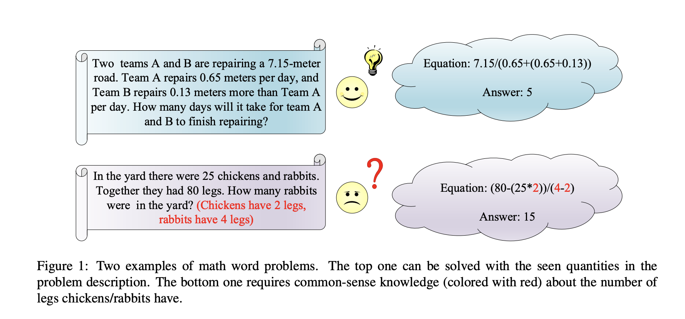
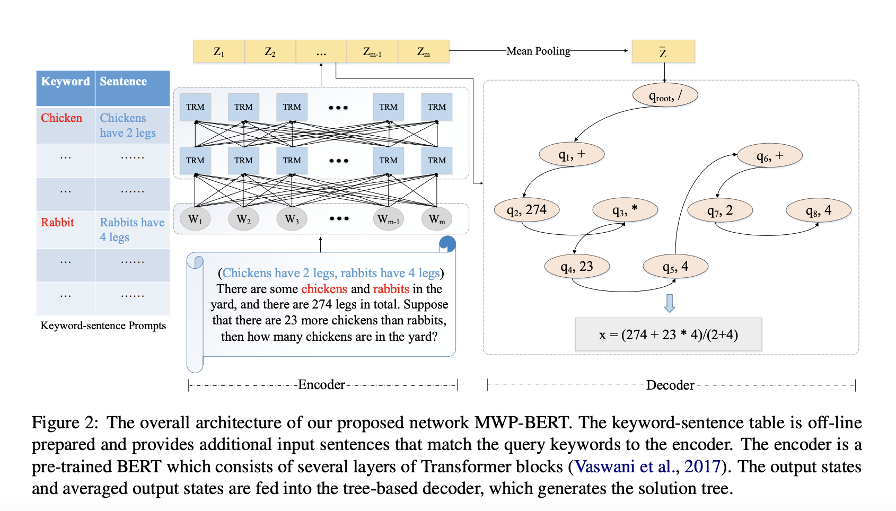

## MWP-BERT: A Strong Baseline for Math Word Problems.
### Liang, Zhenwen, Jipeng Zhang, Jie Shao, and Xiangliang Zhang.
### arXiv preprint [[arXiv:2107.13435](https://arxiv.org/abs/2107.13435)] (2021).

**Whats Unique**
This paper present pre-training for MWP and mechanism to augment commonsense numeric knowledge and learns encodings using BERT, which are used by tree based decoder to outperform current SOTA for Math23K and clean Ape210k dataseet.

**How Does It Work**
* It augment the input data from commonsense pool as follow:

<em>Source: Author</em>

* Architecture of solving MFP with external constant introduction and tree based decoder is as follow:

<em>Source: Author</em>

* BERT is pre-trained on cleaned Ape210K data containing around 120K samples, using MLM objective.

* Tree based decoding like Goal-driven decoding is being used to decompose the output equation.

