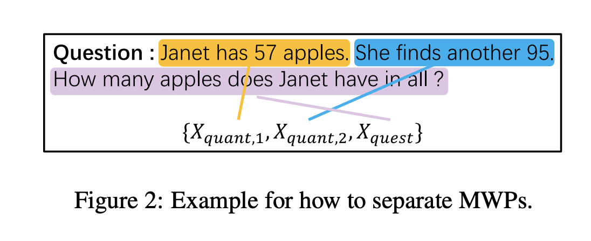
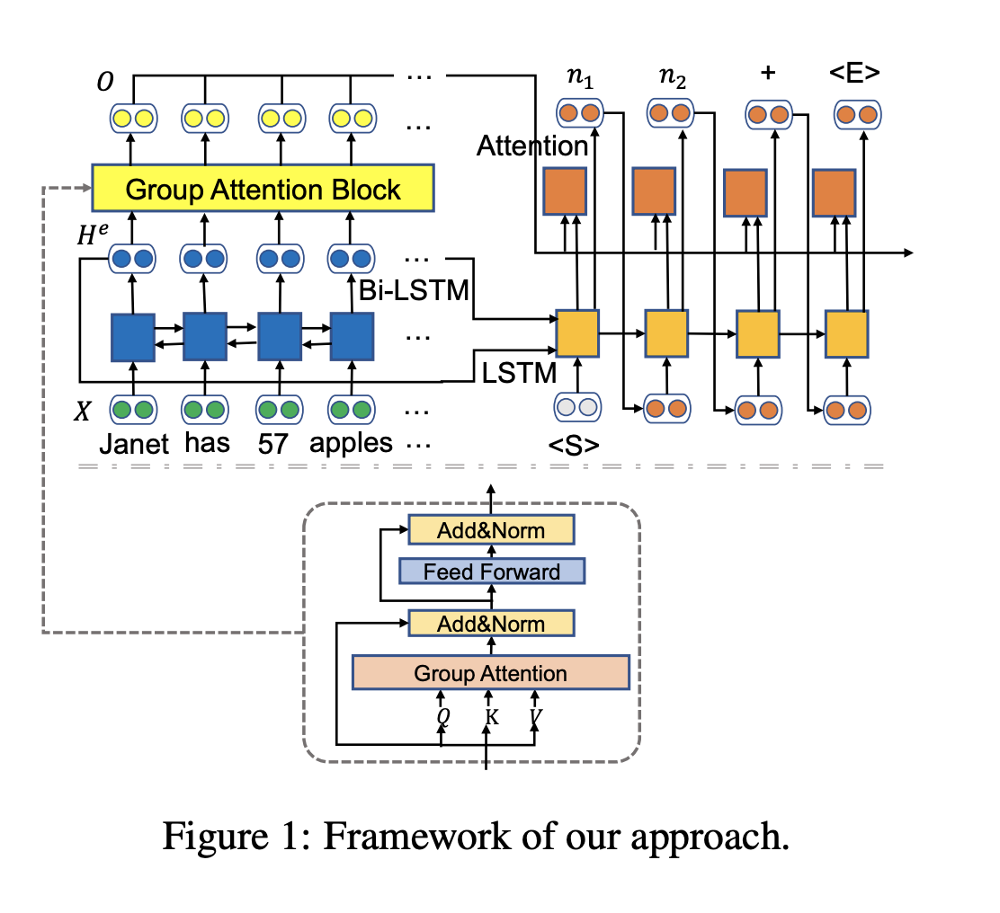
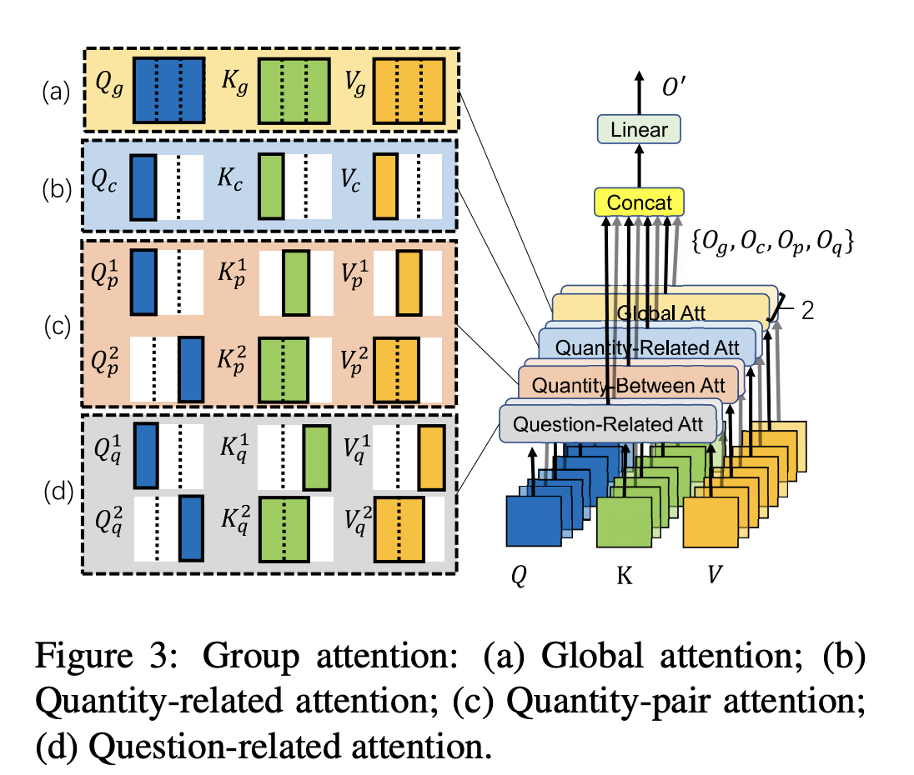
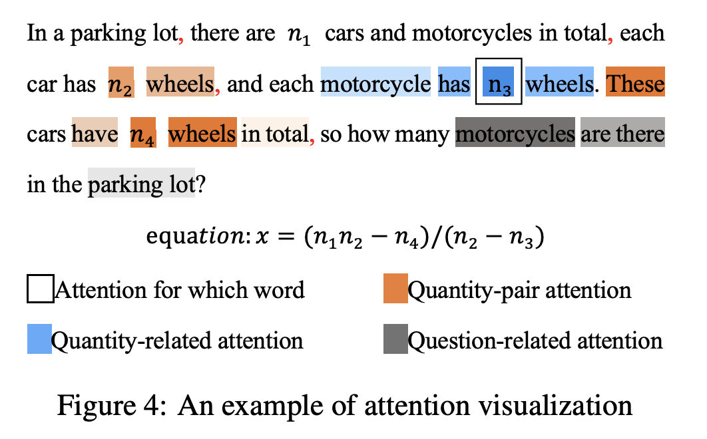

## Modeling intra-relation in math word problems with different functional multi-head attentions.
### Li, Jierui, Lei Wang, Jipeng Zhang, Yan Wang, Bing Tian Dai, and Dongxiang Zhang.
### In Proceedings of the 57th Annual Meeting of the Association for Computational Linguistics, pp. 6162-6167. 2019. [[PDF](https://aclanthology.org/P19-1619.pdf)]

**Whats Unique**
This paper models intra relation in a math word problem, i.e. quantity to words of its span, other quantity span or question span using attention heads. And, shows its effectiveness. 

**How Does It Work**
* It uses BI-LSTM to get the initial encodings of each tokens.
* It partitions the input question into spans. Span is either quantity span or a question span. 

<em>Source: Author</em>

* It implements self-dot-product-attention. It has different heads for different kinds of attention. There are four different types of attentions:
    * Global attention: All tokens from each span attends all tokens from all span
    * Quantity Related Attention: Tokens from quantity span would attend other token of the same quantity span.
    * Quantity pair tokens: Tokens from a quantity span would attends tokens from other quanitity span. Tokens from question span would attend tokens from other quantity spans
    * Question related attention: Tokens from question span would attend tokens from quantity span, and tokens from quantity span would attend quedtion span.
* Architecture can be seen as below:

<em>Source: Author</em>

<em>Source: Author</em>

* Visualization of its attention can be seen as below:

<em>Source: Author</em>

