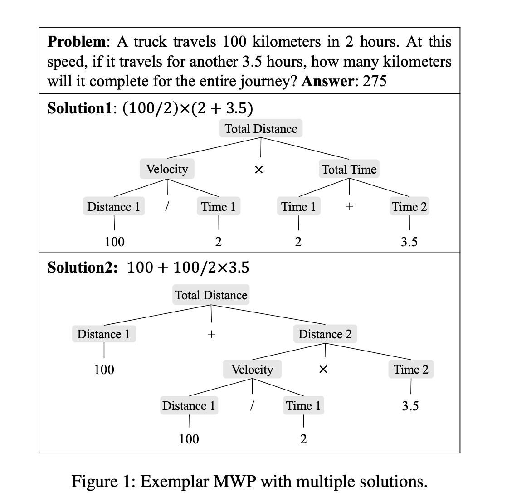
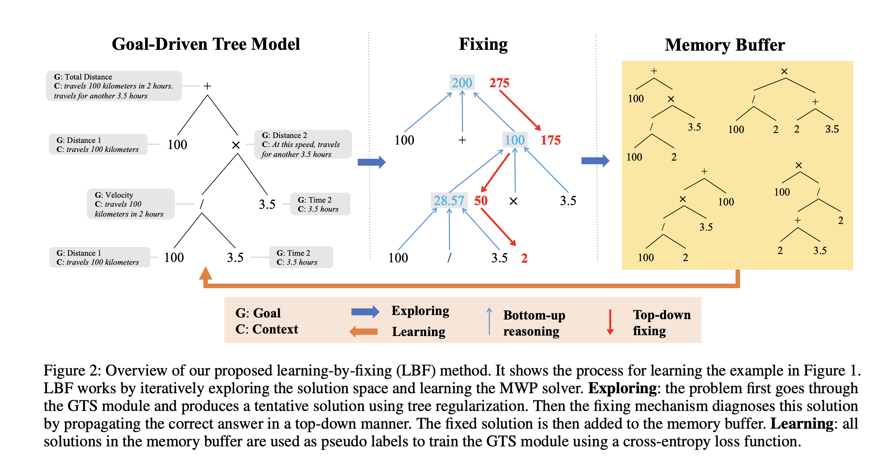

## Learning by Fixing: Solving Math Word Problems with Weak Supervision
### Hong, Yining, Qing Li, Daniel Ciao, Siyuan Huang, and Song-Chun Zhu. 
### In AAAI Conference on Artificial Intelligence. [[PDF](https://www.aaai.org/AAAI21Papers/AAAI-5790.HongY.pdf)] 2021.

**Whats Unique**
This paper presents a weaksupervision approach, where it takes a gold-driven tree-structured decoder model (GTS) generates a tentetive tree with tree regularization, and it validates if expression tree executes to the ground truth answer, if not, it fix the tree by one-fix or multi-fix algorithm, which propogates error from parent to child node, and check if error can be fixed by replacing the node.

**How It Works**
* There are multiple ways to write an expression tree for MWP. So that also becomes a motivation to generate multiple trees and fix them. An example is as below:

<em>Source: Author</em>

* It generates tentitive trees using GTS model
* It fixes them to arrive at the answer using one-fix, etc settings
* It learns on the fixed expression trees.
* Following figure depict the whole process:

<em>Source: Author</em>

* It applies tree regularization while generating tentitive tree using GTS model. It also gives a range of possible sequence length of prefix order of expression tree based on heuristics. Moreover, tree-regularization has following rules:
    1. The number of operators cannot be greater than bl/2c.
    2. Except the l-th position, the number of numeric values
(quantities and constants) cannot be greater than the number of operators.

* Algorithm learns on the labels generated using weak-supervision.
* It achieves good diversity as its top-3 and top-5 tree's accuracy is much higher. Where top 5 tentitive trees are generated using beam search.