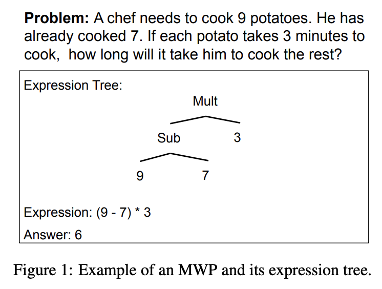
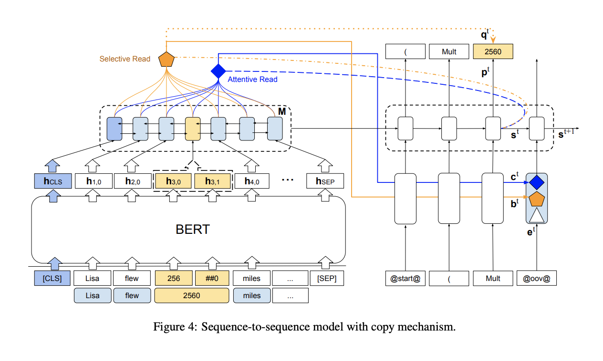

## Investigating Math Word Problems using Pretrained Multilingual Language Models
###  Tan, Minghuan, Lei Wang, Lingxiao Jiang, and Jing Jiang.
### [arXiv preprint (2021)](https://arxiv.org/pdf/2105.08928.pdf).

**Whats Unique**
Author takes highly domain specific problem of solving math word problems, and experiment if the model ability from one language can be transferred to the other language? Can multilinguial setup help? 

**Problem Definition**
Construct expression tree for a given math word problem.

    
    <em>Source: Author</em>
    

**How It Works**
* Pre-trained multilingual model is used as the encoder to get the contexualized representation of Math Word Problem.
* Word level representation are derived using pool operation.
* Sequence to sequence model with copy mechanism (LSTM) is used to generate expression tree.
* Copy mechansim is useful as the decoder model would not have numeric values in its vocabolury. 
* Projecting input words from LSTM encoder hidden representations to a space, and taking dot-product with LSTM decoder state, gives a representation, on which softmax is applied, to give input word level confidence for the copy-mechanism.
* Model architecture is as follow:

    
    <em>Source: Author</em>
    

**Key Findings**
* It uses MathQA and Math23K datasets. Math23K is chinese questions dataset, and MathQA is english math questions, which is adapted to have similar expressions.
* AddSub, SingleOp, MultiArith datasets were used as validation dataset.
* Model trained over one language fails to perform on the other language.
* When model is trained on multi-lingual setup, it gives better and robust performance for both the languages.
