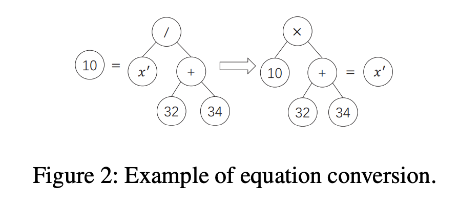
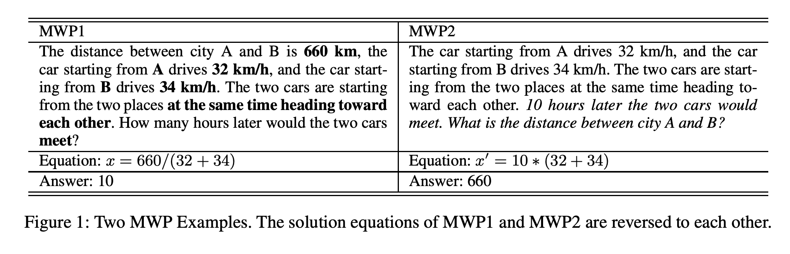

## Reverse Operation based Data Augmentation for Solving Math Word Problems.
### Liu, Qianying, Wenyu Guan, Sujian Li, Fei Cheng, Daisuke Kawahara, and Sadao Kurohashi.
### arXiv preprint [[arXiv:2010.01556](https://arxiv.org/pdf/2010.01556.pdf)] (2020).

**Whats Unique**
This paper presents "reverse operation baed data augmentation" where it flips unknown quantity into a known quantity and make an known quanitity an unknown, with operator inversion, and percolating the change in equation binary tree.

**How Does It Work**
* First it applies "significant number detection" using a classifier
* If a number in a problem is repeated twice, it would be ignoted.
* If a number in the equation is repeated twice, it would be ignored.
* Constants, numbers which does not appear in problem would be ignored.
* Select a number from the remaining set, make it unknown, and unknown quantity a known one.
* It changes equation binary tree accordingly. Example as below:

<em>Source: Author</em>

* It changes sentences in math word problem, by converting an interogative sentence into assertive and assertive into interogative. Example as below:

<em>Source: Author</em>

* It has generated 47,318 problems from original 21,162 problems.
* It acheives performance improvement over SOTA techniques with bigger training data derived using RODA.
* It is also more effective than BT data augmentation.
* It also points out that performance is detoriated when just RODA data is used, that means there is a potential quality issue with new data derived using RODA.

