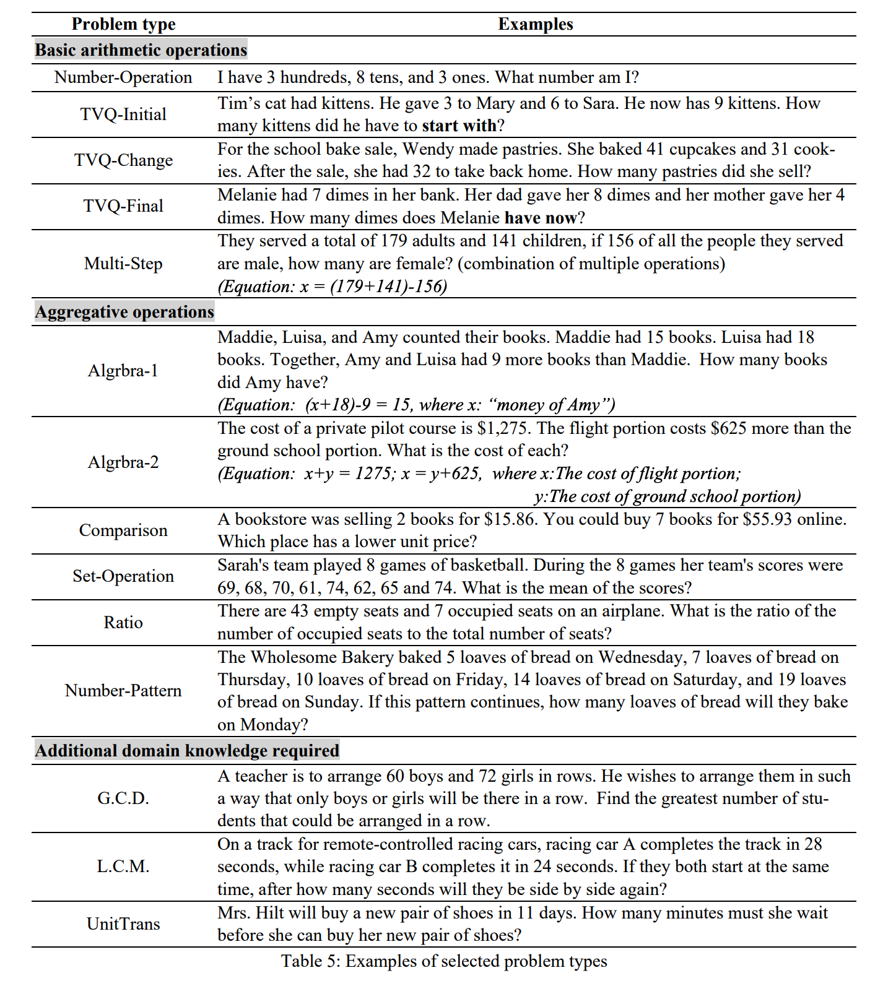
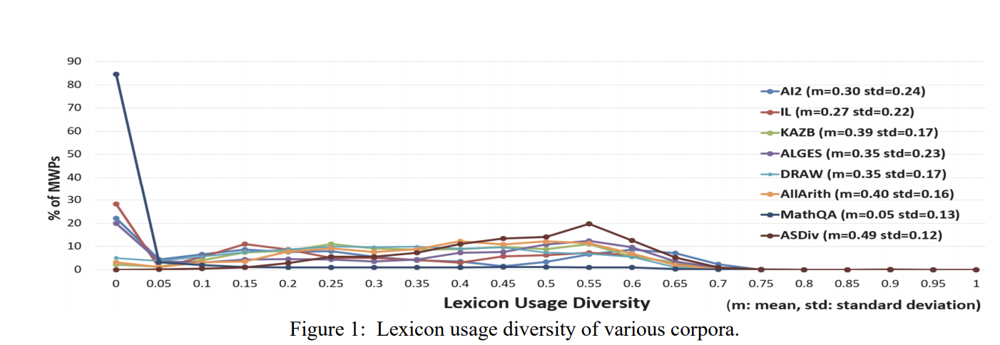
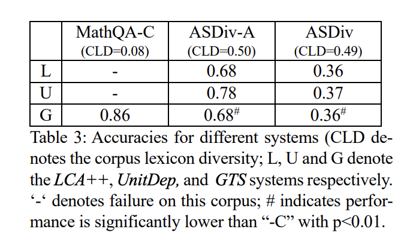

## A diverse corpus for evaluating and developing english math word problem solvers.
### Miao, Shen-Yun, Chao-Chun Liang, and Keh-Yih Su. ["
### arXiv preprint [arXiv:2106.15772](https://arxiv.org/pdf/2106.15772.pdf) (2021).

**Whats Unique**
This paper presents a dataset, which is lexically diverse, and it is annotated with the problem types. It also present a lexicon usage diversity metric. It reports the baseline performance of SOTA models on this dataset.

**Problem Types**
* Currently 24 different Problem Types (PTs) are provided and they are classified into three categories. 
    * Basic arithmatic operations
    * Aggregative operations
    * Additional domain knowledge required
* Few examples are as below:

<em>Source: Author</em>

* Lexicon Diversity Metric:
For a given problem type, BLEU score is computed with all other problems under that problem type, and max BLEU score is substracted from 1, to get the lexicon diversity score.

    

* Problems in MathQA: It has very low lexicon diversity score of 0.05. Other such MWP datasets also have low lexicon diversity score. It can be seen as below:

<em>Source: Author</em>

* It has evaluated SOTA models on MathQA-C (which is subset of MathQA by making it more consistent and error-free) and Asdiv. Results are as below:

<em>Source: Author</em>

