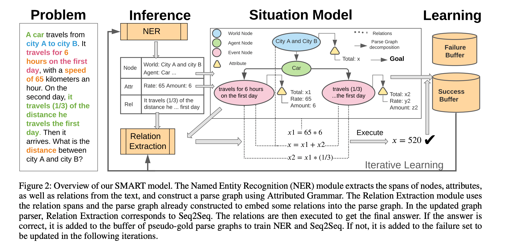

## SMART: A Situation Model for Algebra Story Problems via Attributed Grammar.
### Hong, Yining, Qing Li, Ran Gong, Daniel Ciao, Siyuan Huang, and Song-Chun Zhu. 
### In Proceedings of the AAAI Conference on Artificial Intelligence, vol. 35, no. 14, pp. 13009-13017. 2021. [[PDF](https://arxiv.org/pdf/2012.14011.pdf)]

**Whats Unique**
This paper adopts attributed grammer to build situation representation for the algebra story problems. First, extract information for nodes, attributes, events and relations and then build a parse graph. And it learns this process in an iterative way.

**How Does It Work**
* The basic motivation of this paper comes from human's intuitive way of thinking. Which first build a situation model in the mind to answer a math story question. It could be understood with the figure below:
    

    
    <em>Source: Author</em>
    

* It adopts attributed grammer, which represents World, Agent, Events, and Relations.
* In the context of MWP, using NER it extacts following entities: 
    * Nodes : World, Agent, Events (V_pg)
    * Attributes: values of nodes etc (A_pg)
    * Relations; (E_pg)
* Parse graph is created by joining these nodes based on their distances in the problem text, and distance between dependency tree. 
* Given Nodes, Attributes, and Relations as text, it uses seq2seq model to generate equation.
* So it formulate the problem to get the parse_graph as follow:

    

* Iterative Learning: It builds parge graph using naive methods, and if it evaluates to true answer it becomes the labelled data, and on wich the parge-graph generator model would get trained. The process repeats till it converge.

* Following figure gives the overview of the system:
    

    
    <em>Source: Author</em>
    

* It extracted story types problems, where there are entities/characters etc. It found around 6.6K problems to form the dataset ASP6.6K from Math23K dataset. These 6.6K problems are distributed over four categories, Motion, Task, Relation, and Price.

