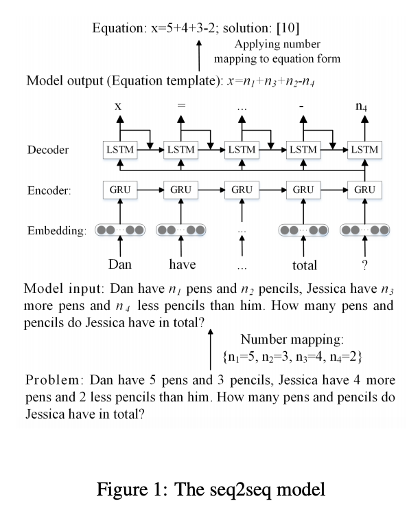
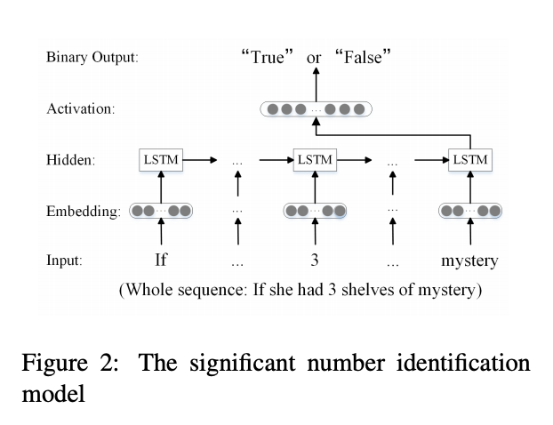

## Deep neural solver for math word problems
### In Proceedings of the 2017 Conference on Empirical Methods in Natural Language Processing, 
### pp. 845-854. 2017 [[PDF](https://aclanthology.org/D17-1088.pdf)].

**Whats Unique**
This paper presents first seq2seq deep neural network model to generate equation for math linear algebra problems. It also releases Math23K dataset.

**How Does It Work**
* It uses GRU as encoder and LSTM as decoder for seq2seq model. Architecture is as follow:

    
    <em>Source: Author</em>
    

* It has also built another neural model for "Significant Number Identification". It helps model to limit its decoder vocabolury. 

    
    <em>Source: Author</em>
    

* It has also built retrieval based model using TFIDF vectors and jacard similarity.
* It observers that retrieval model performs better when the similarity is higher. 
* So, it has developed a hybrid model, which uses seq2seq model when similarity is lesser than the threshold, otherwise uses retrieval model.
* It observed significant improvement for seq2seq and hybrid model.
* 