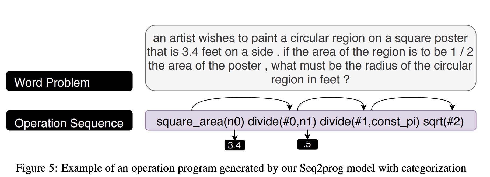
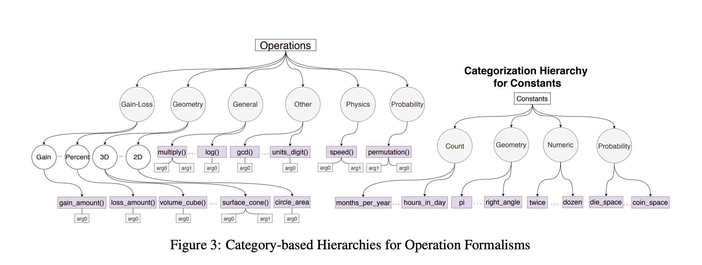

## MathQA: Towards interpretable math word problem solving with operation-based formalisms
### Amini, Aida, Saadia Gabriel, Peter Lin, Rik Koncel-Kedziorski, Yejin Choi, and Hannaneh Hajishirzi.
### arXiv preprint [[arXiv:1905.13319](https://arxiv.org/abs/1905.13319)] (2019).

**Whats Unique**
This paper presents a squence-to-program formulation of solving MWP. And, it presents a representation language for expressing the prgoram as squence of math operiations. It also annotates 37K problems of AQuA dataset. It also presents how "category" could be usable for incrementatl performance. 

**How It Works**
* Sequence to program formulation of a problem, where input text sequence of MWP is to be transformed to sequence of operations with arguments. Example is as below:

    
    <em>Source: Author</em>
    

* Decoder vocaboulary would be mix of all possible math operations, numeric values presents in the quedtions and intermediate computations.
* A hard assigned category based on n-gram overlap is also used to condition decoder. And, it shows marginal improvement.
* Category limits or guide the possible math operations or constants to be used. Can be seen in the following figure.

    
    <em>Source: Author</em>
    

* It brings focus on "interpretability" as the sequence of math operations makes output interpretable and demonstrate the reasoning capability of the model.
* It trains model on MathQA and apply it over AQuA, and demonstrate its effectiveness, as model is able to generalize well.

**Our Findings**
* When we try to reproduce the results, we found that there is a serious data leakage between test and train data split, as questions are template based, and its instances are persent in train, val and test splits, where each instances have exactly same word text with only different numericals.
* And, because of this leak, if we train the model for more steps, we are able to achieve near 90% accuracy.

