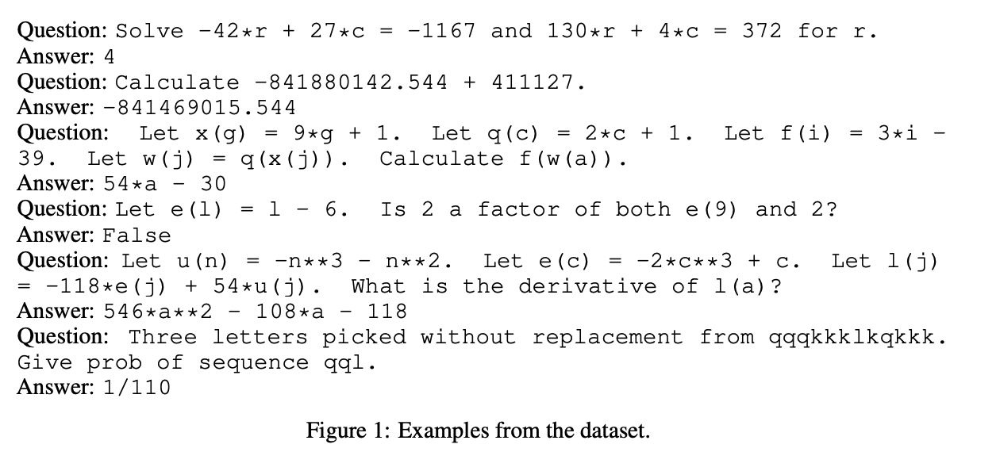
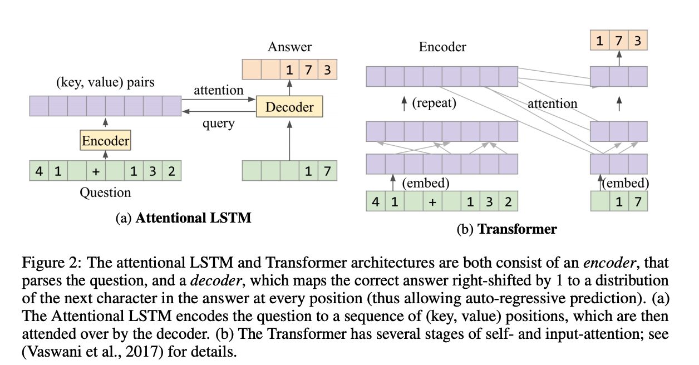

## Analysing mathematical reasoning abilities of neural models.
### Saxton, David, Edward Grefenstette, Felix Hill, and Pushmeet Kohli.
### arXiv preprint [[arXiv:1904.01557](https://arxiv.org/pdf/1904.01557.pdf)] (2019).

**Whats Unique**
This paper presents a training dataset of 2*10^6 math questions having unique answers, and test dataset of 10^5 questions across wide topics of maths. The idea is to test interpolation and extrapolation numerical ability of different kinds of model.

**How Does It Work**
* This dataset contains maths questions from these topics: Algebra, Arithmatic, Calculus, Comparisons, Measurement, Numbers, Polynomials, Probability etc. Examples of the questions as below:

    
    <em>Source: Author</em>
    

* It tests three seq2seq architectures, LSTM, LSTM with Attentions, and Transformers, Figures as below:

    
    <em>Source: Author</em>
    

* Intrapolation ability is the ability to answer a similar question to a training questions with numeric parameters changed. And, extrapolation ability is to answer new problem, which is composed of different mathamatical concepts.
* Transformers have given the best performance, as high as 75% accuracy on the intrapolation and 50% on the extrapolation.
* This paper shows that linguistic reasoning ability is equally complex and it is difficult to achieve. i.e. r, the question “Calculate 17 * 4.” gave the correct answer 68, but the same question without the final full stop gave 69.
* Ability to directly arrive at computed answer does lack the interpretability. 
* One needs to put in more effort to probe the reasoning ability of transformers. 

