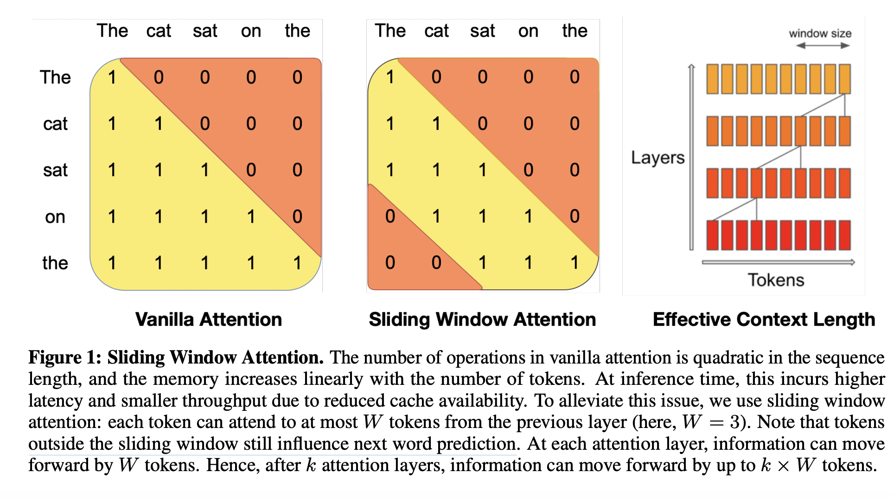

## Mistral 7B.
### Jiang, Albert Q., et al
### [[PDF](https://arxiv.org/pdf/2310.06825.pdf)]

**Whats Unique**

- Mistral7B model focus on the superior performance and efficiency.
- It leverage mainly two importance concepts
    - GQA: Grouped Query Attention
    - SWA: Sliding Window Attention
- Sliding Window Attention makes infernce very efficient, and effectively handles longer query, which makes LLM more performant. 
- SWA still allows tokens outside of the window length to influence next token prediction, across the layers.

<em>Source: Author</em>

- Mistral7B matches the performance of LAMMA of size 3x larger, and outperforms LAMMA models of similar sizes.
 
- System prompts to enforce guardrails are really effective on Mistral as compared to Lamma. 
    - System prompt: Always assist with care, respect, and truth. Respond with utmost utility yet securely. Avoid harmful, unethical, prejudiced, or negative content. Ensure replies promote fairness and positivity
    - Note, Lamma refuse to answer question "how to kill linux process", but Mistral gives correct answer.

