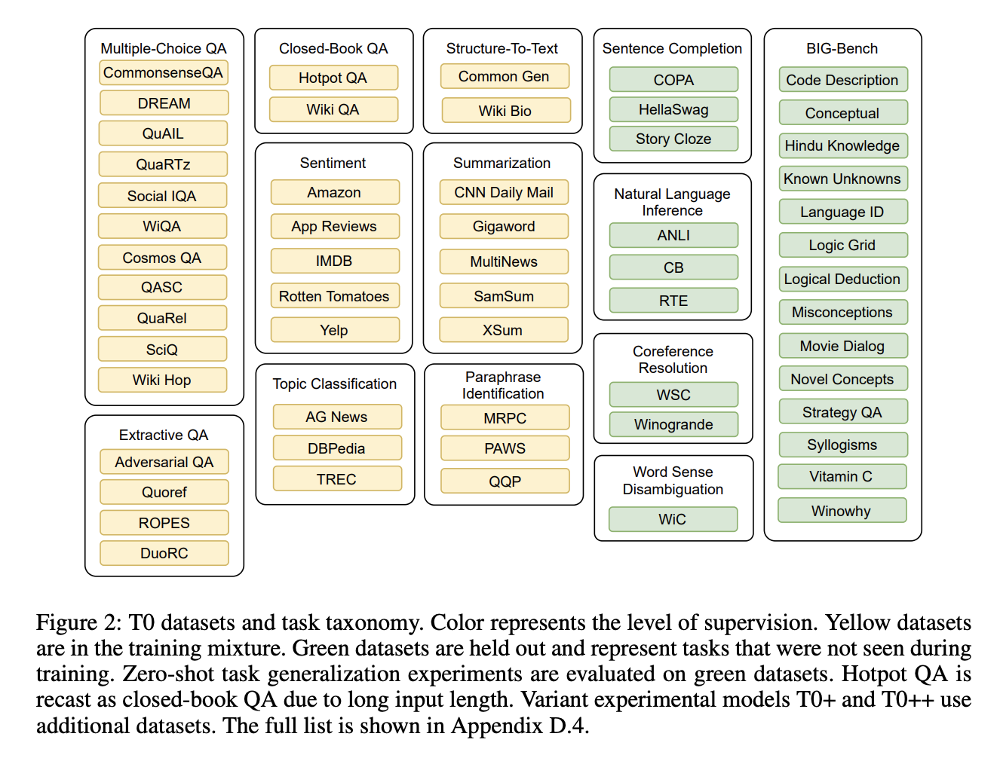
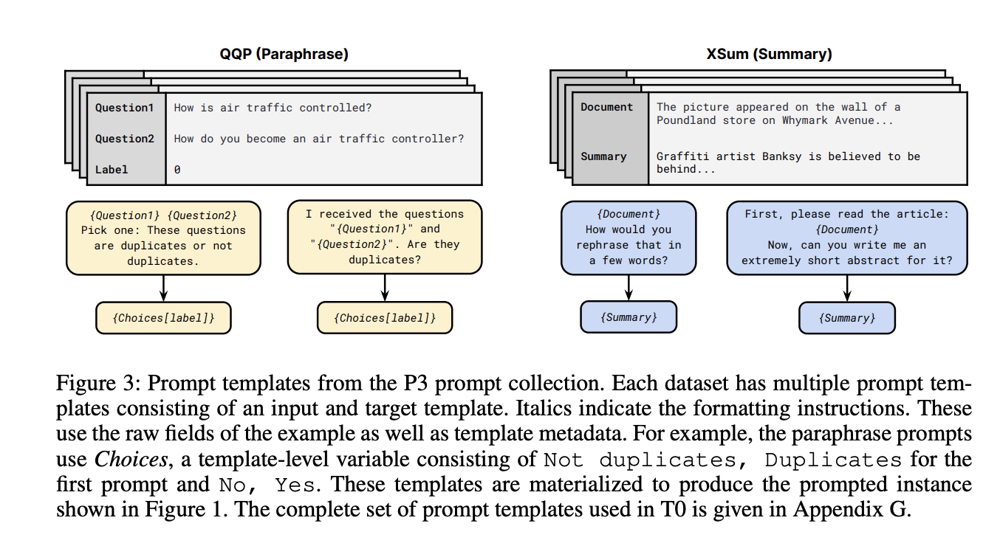
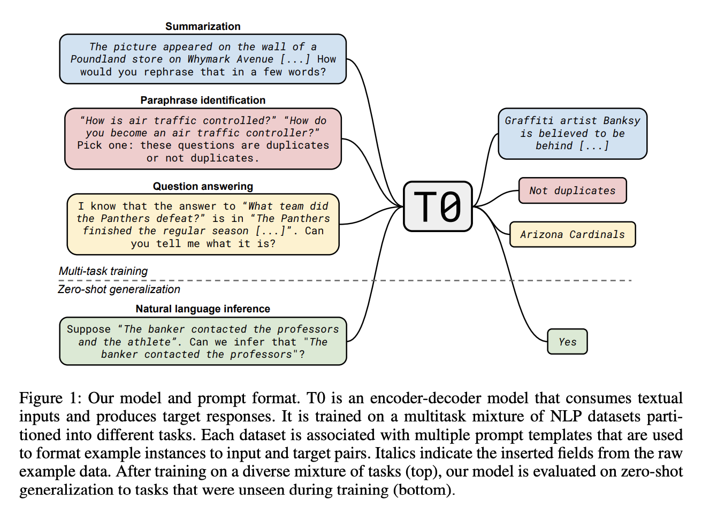

## Multitask Prompted Training Enables Zero-Shot Task Generalization
### Victor Sanh, Albert Webson, Colin Raffel et al. 2021, 
## [[arXiv](https://arxiv.org/abs/2110.08207)]

**Whats Unique**
This paper seeks answers to following questions:
1. does multitask prompted training improve generalization to unseen tasks?
2. does training on a wider range of prompts improve robustness to prompt wording?
In essence, fine-tuning pre-trained langauge model like T5 in multi-task multi-prompt setup increases generalisation ability.

**How It Works**
* Datasets were grouped as tasks, which needs similar capability to solve.
* Tasks which human are great at without explicit training are kept as held out sets, which are, (i) natural language
inference (NLI), (ii) sentence completion, (iii) word sense disambiguation, and (iv) coreference resolution
* Tasks are datasets used for training are evaluation are as follow:
    

    
    <em>Source: Author</em>
    

* 1939 prompts for 171 datasets (11.3 prompts per dataset on average) were crowd sourced, and they are used during fine tuning. Examples are as follow.. (even prompt and labels changes according to the prompt)
    

    
    <em>Source: Author</em>
    

* Following figure gives functional illustration of T0, as below..
    

    
    <em>Source: Author</em>
    

    