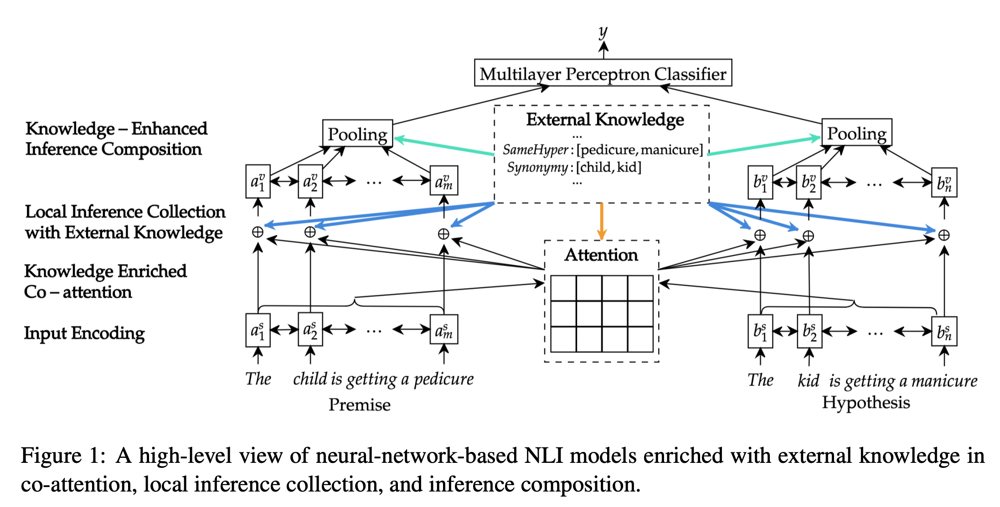
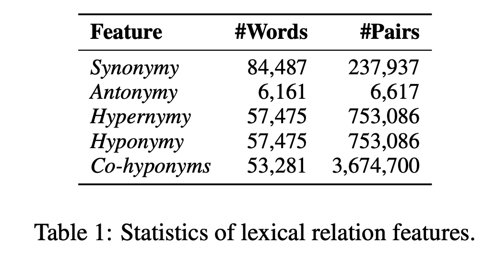

## Neural Natural Language Inference Models Enhanced with External Knowledge
### Qian Chen et al
### ACL 2018

**Whats New**

This paper investigates the impact of integrating external knowledge from WordNet about the pairs of the words at co-attention level, local infernce collection, and knowledge-enhanced composition.

**How It Works**
Following figure illustrates the approach
    

    
    <em>Source: Author</em>
    

As shown in the figure, it integrates external knowledge at different constructs

* External lexical knowledge relation:
    * r \in R^d_r, d_r = 5, Synonymy, Antonymy, Hypernymy, Hyponymy, Co-hyponyms. Statistics about these features are as follow:
    

    
    <em>Source: Author</em>
    

* Knowledge enriched Co-attention:

    

    * Attention weighted alignment vector for hypothesis and premise are as follow:

    

* Local Inference Collection with External Knowledge

    
    

* Knowledge-Enhanced Inference Composition
    * Compositions can be thought as hidden representation of biLSTM layer

        
        

    * Attention-and-lexical-knwoledge weighted pooling is computed as below:

        

**Results**
* It shows that it achieved 1-2% higher performance then SOTA technique on NLI tasks, SNLI, MNLI etc
* Ablation study where external knwoledge was integrated in either or of Attention, Infernce, and Composition.
* Ablation study on impact of controlling number of samples to be enhanced with external knowledge.
* It has shown samples where previous SOTA fails, but current method excels, and attributed that to external knowledge.

