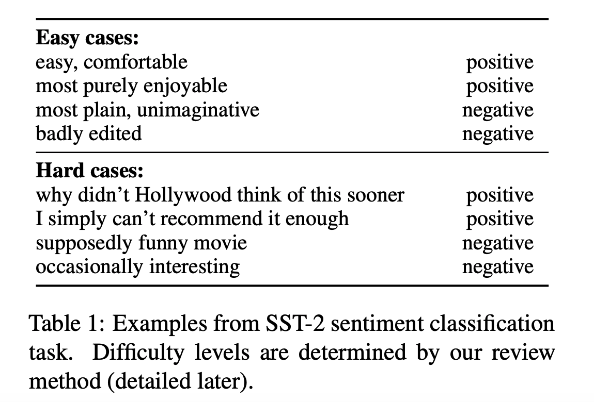
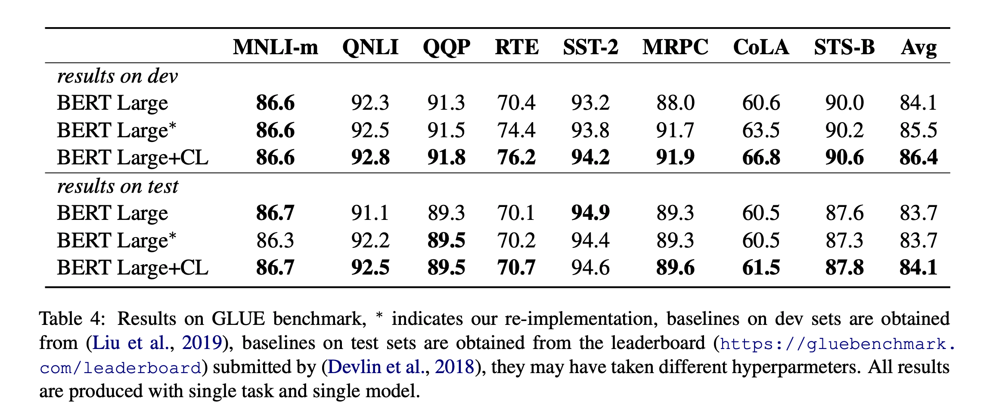

## Curriculum learning for natural language understanding.
### Xu, Benfeng, Licheng Zhang, Zhendong Mao, Quan Wang, Hongtao Xie, and Yongdong Zhang. 
### ACL, 2020 [[ACLWeb](https://www.aclweb.org/anthology/2020.acl-main.542.pdf)]

**Whats Unique**
This paper presents a systematic way to incorporate curriculam learning while doing NLU tasks fine tuning for GLUE tasks. CL was originally proposed by Benjio in 2009. Authors have divided the approach into two phases, difficulty evaluation and Curriculum Arrangement.

**How It Works**
* Basic concept of CL is that, model should be fine tuned on increasingly complex examples for effectiveness in learning.
* Following figure gives an illustationary example, where some examples are easy while other are complex. 

<em>Source: Author</em>

* Difficulty Evaluation:
    * Training data are partitioned into N partition, with each subset of training data, a model is trained. These N models are used for difficulty evaluation.
    * Difficulty of training example is the average task-metric from N-1 models (i.e. leaving aside the model that has seen the example)

* Curriculum Arrangement
    * First, sort all the examples by its difficulty, and divide them into N buckets.
    * For each learning stage Si, sample examples from all antecedents buckets by the proportion of the number of examples in that bucket.
    * Add last learning stage, S_N+1 which is nothing but the entire dataset.
    * This algorithm is called "Anneleaning" method, which provides a softer tranistion.

* Results:

<em>Source: Author</em>

