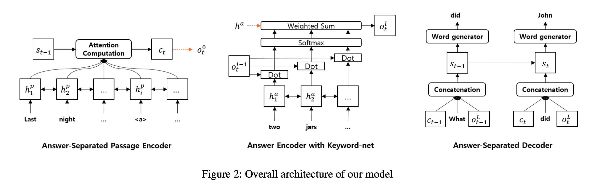

## Improving Neural Question Generation using Answer Separation
### Yanghoon Kim, Hwanhee Lee, Joongbo Shin and Kyomin Jung
### AAAI 2018 [[arXiv](https://arxiv.org/pdf/1809.02393.pdf)]

**Whats Unique**
This paper claims and validate that masking answer in a passage, and having a seperate encoder of seperated answer, would enable decoder to generate better questions, which would be more relevant as they would not contain answer information in them.

**Contribution**
1. Masking out answer in passage encoder
2. Keyword-net model, to encode key features to feed to decoder
3. decoder infromed by passage encoding, key features enconding of keyword net, and retrieval based mechanism to generate question
4. It generate words by querying word embedding.

**Architecture Diagram**
Following diagram illustrate the process.

    
    <em>Source: Author</em>
    

* Problem Statement

    

* Encoder 

    

* Answer Encoder

    

* Retrieval Based Decoder

    

**Note**
* It has compared the baseline performance which was answer-unaware.