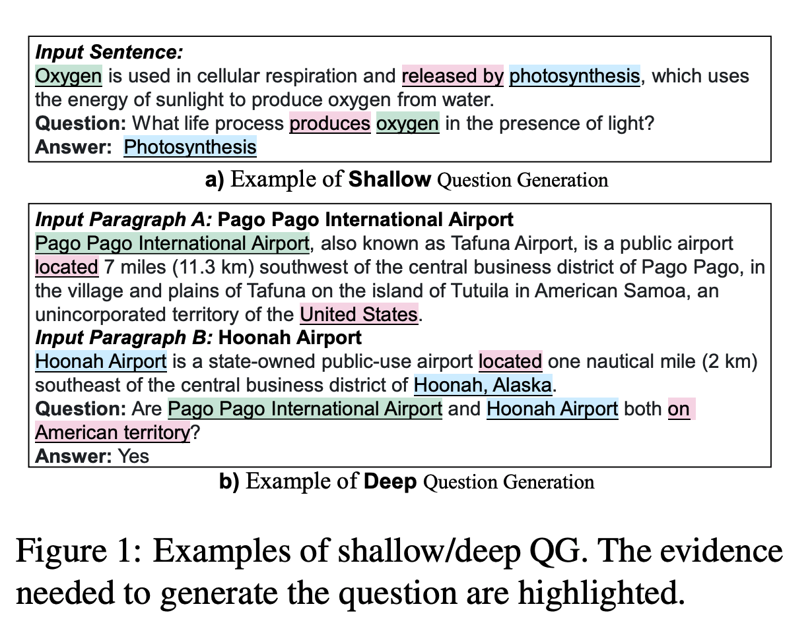
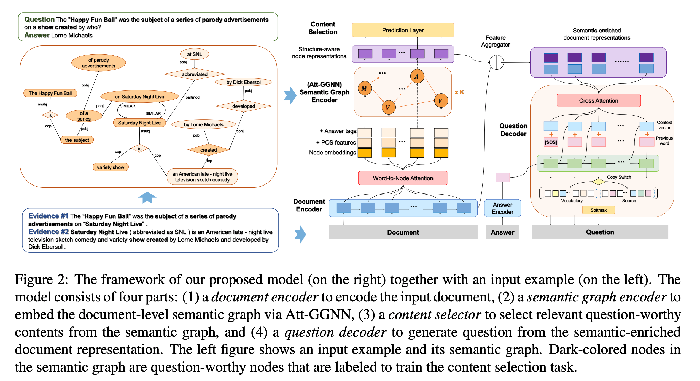
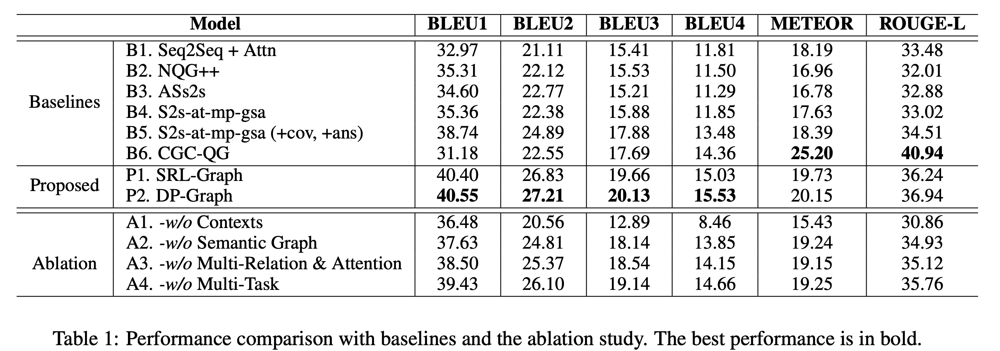

## Semantic Graphs for Generating Deep Questions
### Liangming Pan, Yuxi Xie, Yansong Feng, Tat-Seng Chua, Min-Yen Kan
### ACL 2020 [[arXiv](https://arxiv.org/abs/2004.12704)] 

**Whats Unique**
This paper presents a technique for Deep Question Generation. It fuses document level and semantic graph level representations, and generate questions using attention mechanism. It has dual objective of content selection and question construction.

**How It Works**
    

    
    <em>Source: Author</em>
    

The architecture diagram for the DQG can be seen as below:
    

    
    <em>Source: Author</em>
    

* Problem statement
Given the document D and the answer A, the objective is to generate a question Q, that satisfies:

    

* Semantic Graph Construction
    * SRL based graph
    * Dependency parse tree graph

* Semantic Enriched Document Representations
    * Document Encoding
        * D = [w1, · · · , wl]
        * X_D = [x1, · · · , xl]
        * x_i = [x_i->; x_i<-]

    * Node Initialisation
        * G = (V, E)
        * V = {v_i}_i=1:Nv
        * E = {e_k}_k=1:Ne
        * Each node of the graph is a text span in document involving neighbour words. 
        * Initial representation of node is obtained by computing word to node attention. 
        * Document encoding: d_D in both direction
        * 
        * 
        * 
    
        * In esscence, each node of the graph would have multiple words, attention for each of those word would be computed in context of whole document embeddings. And, node represenation would be the weighted embedding of those words.

    * Graph Encoding (Att-GGNN) - Attention based gated graph neural network
        * Represeantions based on incoming edges, and outgoing edges, weighted by attentions between nodes, and also weighted by the type of the edge between nodes is computed as follow:

        * 

        * Where, attention between two nodes are computed as below:
    
        

        * Hiddent state after k-th transition is as follow:

        

    * Fusing graph and document represeantions. It uses a matching strategy where a finest granular node in graph which comaintains the document word is selected.
* Joint Task Question Generation

    * Sementic enriched encoded representations as the attention memomry to generate the output sequence. 
    * Decoder hidden state is initialised with answer embeddings
    * At each step model learns to generate
        * Context vector c_t from semantic enriched encoded representations
        * Decoding state s_t
        * Copying probability is computed based on c_t, s_t, and y_t-1
        * Copyting probability to generate word from vocabolory or from document inputs
        * Coverage vector - to penalise attending over same locations of input documents.
    * Content selection task specific layer as multi task training.

* Evaluation
    * BLEU, ROUGE, METEOR scores
    * Human evaluations with three dimensions, fluency, relevance, and complexity.

    

    
    <em>Source: Author</em>
    

    * Also, Ablation study for design decisions.

