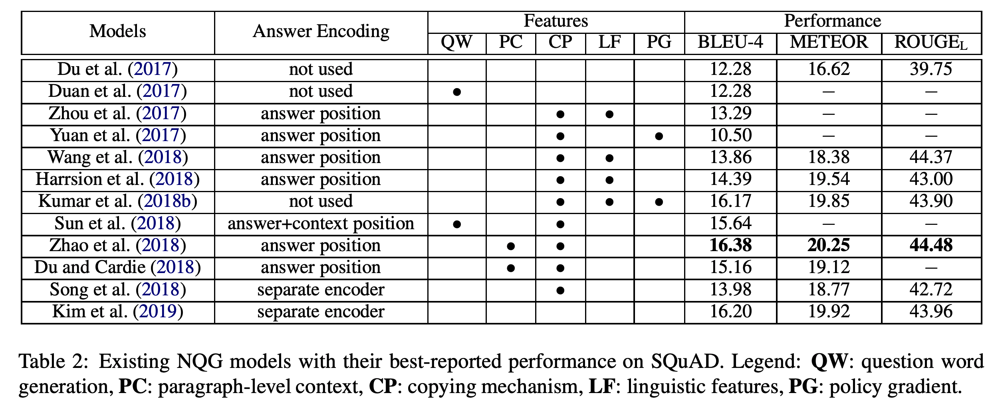

## Recent Advances in Neural Question Generation
### Liangming Pan, Wenqiang Lei, Tat-Seng Chua and Min-Yen Kan
### 2019, [[arXiv](https://arxiv.org/pdf/1905.08949.pdf)]

**Whats Unique**
Survey paper for neural question generation.

**Fundamental Aspects of NQG**
* Leanring Paradigm
    - What to ask: "Content Selection"
        * Syntatic and/or Semantic parsing
    - How to ask: "Question Construction"
        * transformational
        * template-based
    - End-to-end architecture in neural models
        * parsing based content selection is replaced by
            * Copying mechanism
            * Attention

    

        
        <em>Source: Author</em>
        

* Input Modalities
    * traiditional QG: textual inputs (declarative sentences)
    * KBQA: knowledge base QA
    * Image/image captions

* Cognitive levels
    * Blooms taxonomy
    * Traditionaly, factoids, what/who/where etc

* Corpora
    * SQuAD
    * MS MARCO
    * LearningQ

* Evaluation Metrics
    * BLEU
    * ROUGE
    * METEOR 
    * Khapra et al. 2018 - suggested: "Answerability"

* Encoding Answers
    * Augment input vector with answer indicator feature
    * Two seprate RNNs which encodes passage and answer seperately
    * Flexible way is to encode passage and answer seperately

* Question word generation
    * Duan et al. 2017 - two seq2seq models, first model generates the question template

* Paragraph level context
    * Attention
    * Coreference and prefilitering
    * Fusing gate, concatenate info extracted in different ways

* Answer unaware QG:
    * Direct selection of question worthy sentences
    * neural keyphrase extractor 
    * However, what aspect to ask is challanging

* Technical considerations
    * Copying mechanism
    * Linguistic feature
    * Policy gradients

* Emerging Trends
    * Multi task learnign - i.e. QG and QA getting trained together
    * Wider input modalities
        * KB triples
        * Mitesh Khapra's work to avoid overgeneral questions from KB triples
        * Visually grounded
    * Generating deep questions