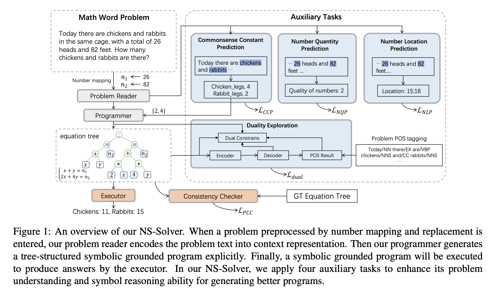

## Neural-Symbolic Solver for Math Word Problems with Auxiliary Tasks
## Qin, Jinghui, Xiaodan Liang, Yining Hong, Jianheng Tang, and Liang Lin. 
### arXiv preprint [arXiv:2107.01431](https://arxiv.org/pdf/2107.01431.pdf) (2021).

**Whats Unique**
It seamlessly incorporates different levels of symbolic constraints by auxiliary tasks. It takes self supervised auxiliary tasks like predicting number location, and number quantities, commonsense knowledge prediction, program (ie. expression tree) consistency checker, dual learning by generating problem's part-of-speech generation.

**How It Works**
* It leverages following streams:
    * Neuro-symbolic computing, which has greatly promoted the development of semantic parsing.
    * Self supervised learning with auxiliary tasks
    * Dual learning - like a multi-task learning.

* It has three component, (1) Program Reader, (2) Programmer, (3) Executer
    * Program Reader: Bi-directional GRU
    * Programmer: Decoder prefix-program-tree. Decoder points to symbols table which has following parts
        * math operators
        * unknown variables, x, y
        * commonsense constant predicted by commonsense prediction task
        * problem specific number templates.
    * Executor

* Program Reader: It leverages auxiliary tasks for neuro-symbolik computing, which are, Commonsense Prediction Task, Number Quantity Prediction, and Number location prediction. 

* Programmer: It outputs the prefix prgoram tree, and with duality exploration, by generating POS for problem. It also apply consistency checker for the expression tree.

* Following figure gives an overview for the NSSolver.

    
    <em>Source: Author</em>
    
