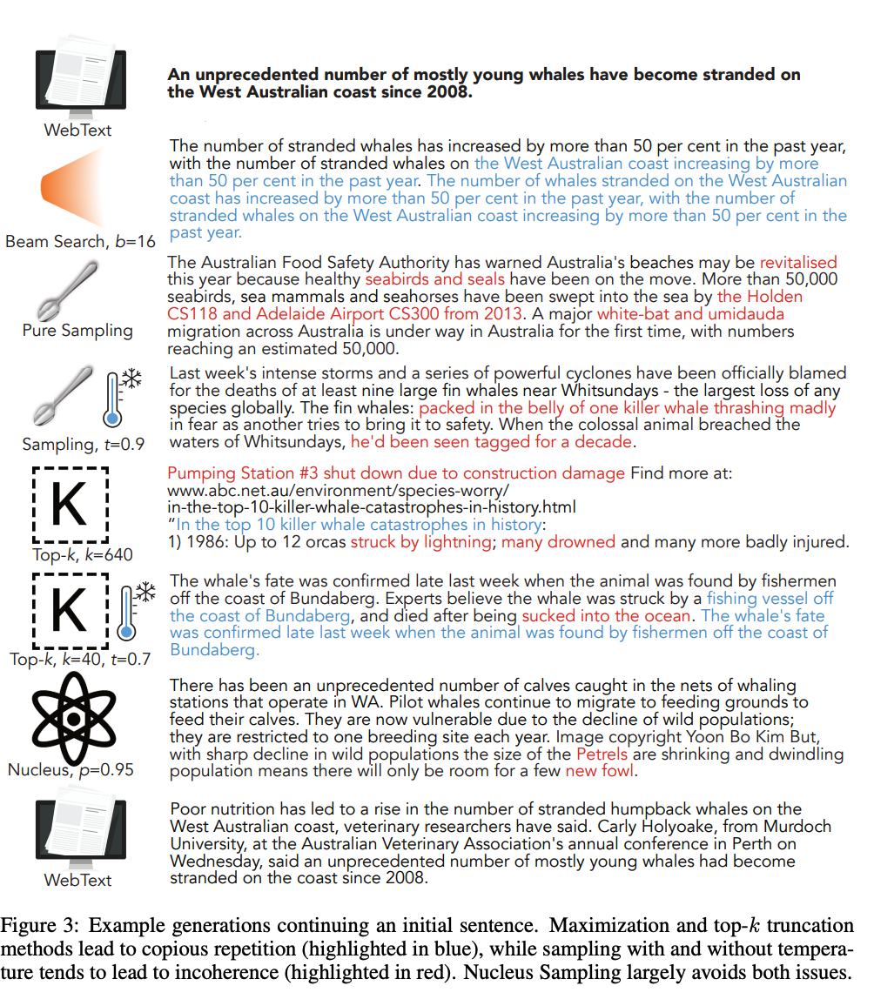
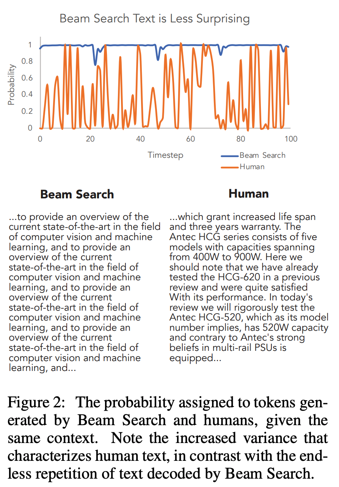
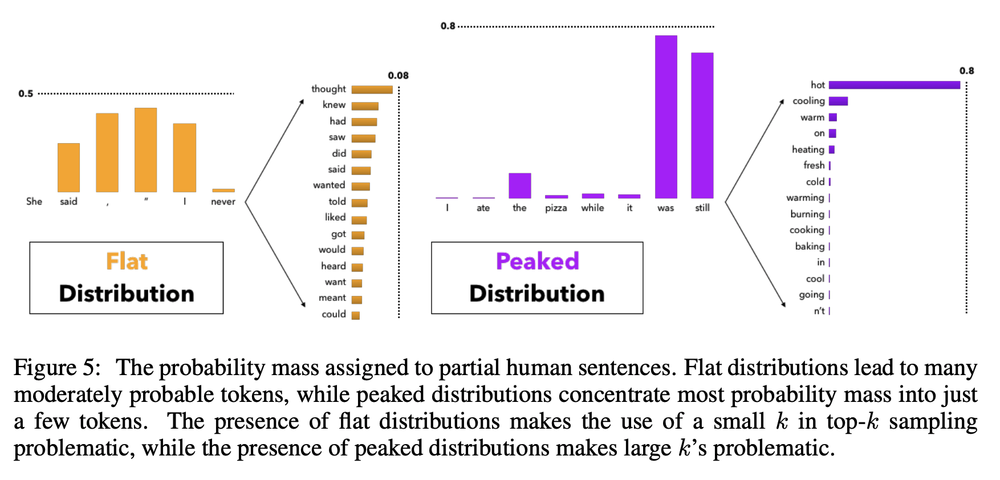

## The curious case of neural text degeneration.
### Holtzman, Ari, Jan Buys, Li Du, Maxwell Forbes, and Yejin Choi
### arXiv preprint [[arXiv:1904.09751](https://arxiv.org/pdf/1904.09751.pdf)] (2019).

**Whats Unique**
This paper demonstrate an effective method, Nucleus Sampling, to generate text, which is more close to humans in terms of probability, perplexity, diversitiy and quality. It compares Nucleus sampling with other methods like Beam Search, Pure Sampling, Top-k sampling with different temperatures. 

**How It Works**
* Beam Search: It alyways consider top k paths, and generate one with the highest probability.
* Pure Sampling: Next token is always sampled using the probability distribution.
* Top-K sampling: Next token is sampled from fixed k tokens based on their probabilitiy distrubution, Note that probabilities of all other tokens (not in top-K) is truncated, and probabilities for top-k tokens are re-adjusted.
* Top-K sampling with temperature: Temperature is divided from the logit value, on which softmax is applied. Lower temperature gives very steep probability distribution.
    

* Nucleus Sampling: A minimal subset of tokens having cumulative probability greater than p is considered as nucleus. And, tokens are sampled based on its normalised probability distribution.

    

**Analysis**
* This paper brings lots of analysis and insights.
* Example of text generated by different sampling methods:

    
    <em>Source: Author</em>
    

* The conditional probability of the next token for human generated text and beam search generated text is as below:

    
    <em>Source: Author</em>
    

* Why Top-K sampling is problematic. If next token candidates have "flat probability distribution", a small value of k would carry the risk of generating bland or generic texts. On the other hand, if next token candidates have "peaked distribution", choosing high value for k would lead to incoherant and unnatural text generation. 

    
    <em>Source: Author</em>
    

* Self-BLEU was used to evaluate how diverse are generated texts. 
* HUSE: Human Unified Statistical Evaluation: Where a classifer is trained to classify if text is human generated or model generated using two features, probability and human judgement of "typicality". 