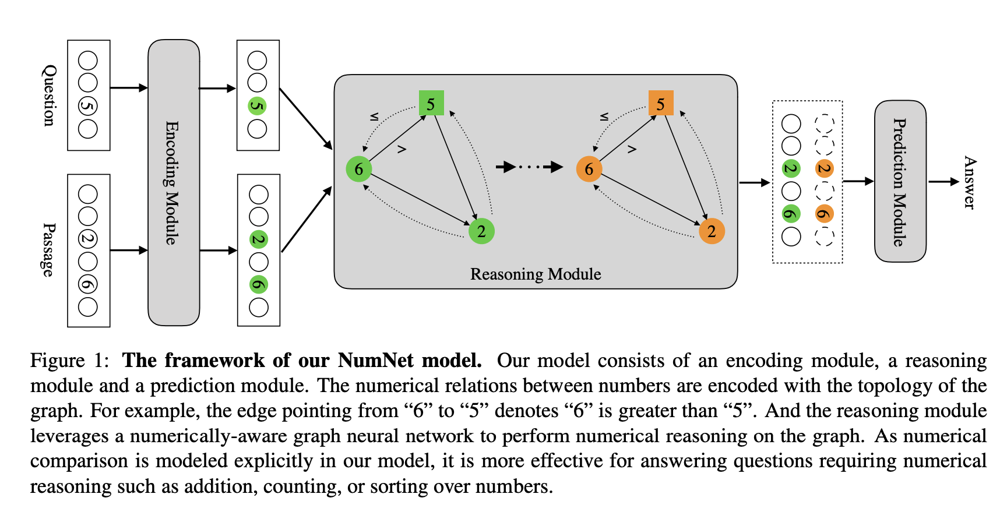
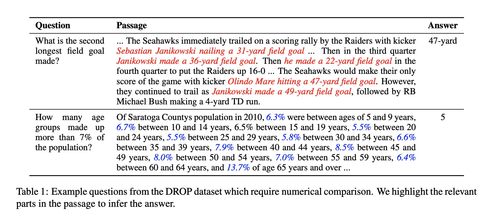

## NumNet: Machine reading comprehension with numerical reasoning
### Ran, Qiu, Yankai Lin, Peng Li, Jie Zhou, and Zhiyuan Liu. 
### arXiv preprint [arXiv:1910.06701](https://arxiv.org/abs/1910.06701) (2019).

**Whats New**
This paper introude a numerical reasoning module between the encoding layer and a prediction layer. Numerical reasoning layer is a graph neural network with numerical comparision edges. And, it generates predictions for various output class, with a class prediction probability as well.

**How Does It Work**
* As shown in the following architecture diagram, it has three layers, encoding layer, reasoning layer and predicition layer.

    
    <em>Source: Author</em>
    

* Encoding layer, words in questions and context para are encodeded by attending each other. 
* Graph neural network is built for graph edges like greater than, and less-than-equal-to.
* Numerical represnetation developed in GNN is concatanated to encoder representations.
* Prediction layer is built for passage span, question span, count, and arithmatic comparision class.
* Multiple iterations on GNN are performed to get multiple hops in numerical reasoning.

* It validates its performance on the DROP dataset. few examples are as below:

    
    <em>Source: Author</em>
    

* Ablation study was performed, by altering the configuration in GNN.

