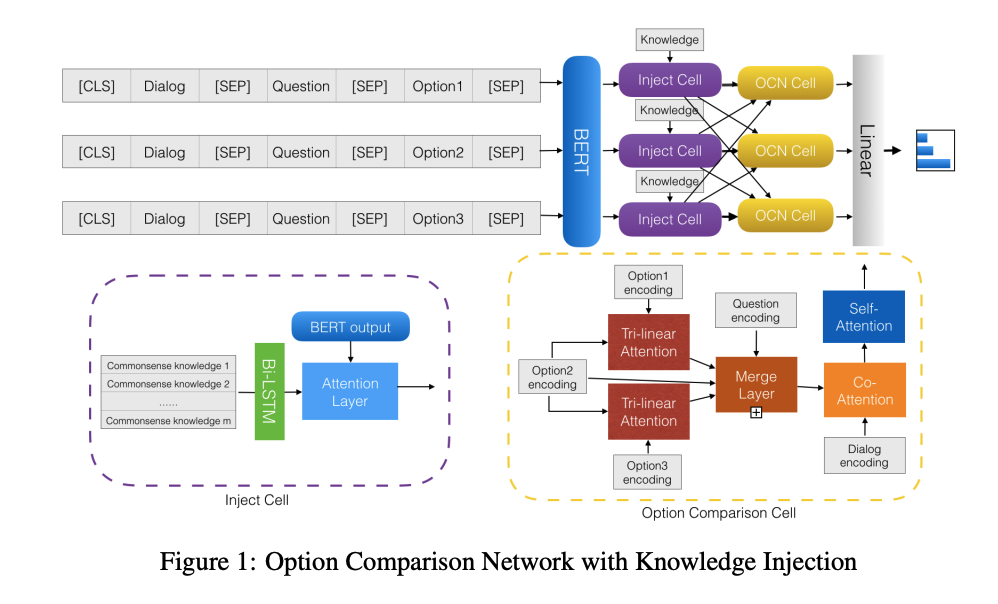
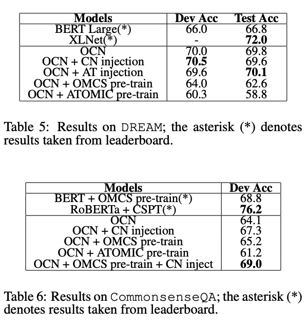

## Towards Generalizable Neuro-Symbolic Systems for Commonsense Question Answering
### Kaixin Ma et al. 
### COIN workshop, ACL 2019 [[arXiv](https://www.aclweb.org/anthology/D19-6003.pdf)]

**Whats New**
This paper present the knowledge ingection experiements on Option Comparison Network for commonsense question answering.

**Important Points**
* Different kinds of Knowledge Graphs would be needed based on underlying nature of data and task.
    * **Declarative commonsense** encompasses factual knowledge, e.g., ‘the sky isblue’, ‘Paris is in France’; 
    * **Taxonomic knowledge** ,e.g., ‘football players are athletes’, ‘cats are mammals’; relational knowledge, e.g., ‘the nose is partof the skull’, ‘handwriting requires a hand anda writing instrument’; 
    * **Procedural commonsense** ,which includes prescriptive knowledge, e.g., ‘oneneeds an oven before baking cakes’, ‘the electricity should be off while the switch is being repaired’
    * **Sentiment knowledge** ,e.g., ‘rushing to the hospital makes people worried’, ‘being in vacation makes people relaxed’;Metaphorical knowledge (e.g., ‘time flies’,‘raining cats and dogs’). 

**How It Works**
* It demonstrate impact of following:
    * Knowledge Injection 
    * Pretrainig on Knowledge base
* It selects two datasets for its experiments:
    * DREAM
    * CommonsenseQA
* It selects two knowledge bases for injecting different kinds of knowledge
    * ConceptNet: 21 millions edges, and 8 million nodes. It is most common semantic network for common sense
    * ATOMIC: new knowledge base focuses on procedural knowlege
* Following figure illsutrates the architecture
    

    
    <em>Source: Author</em>
    

    
* Knowledge Ingection:
    
    * As shown above, T_enc is the enocoding of dialogue, question and answer option.
    * H_M is the encoding of relevant knolwedge from knowledge base
    * H_M is projected to T_enc space
    * S similarity matrix is computed using trilinear attention between H_M and T_enc
    * Text-to-knowledge attention is computed using similarity matrix, A_m
    * Knowledge-to-text attention is computed, A_t
    * Knowledge aware T_enc is produced as T_out

* Knowledge Pre-training
    * OMCS (dataset behind ConceptNet) was used for BERT pretraining
    * COMET was used to convert ATOMIC to senstences, and used to pre-train BERT.
    
* Results are as follow:
    

    
    <em>Source: Author</em>
    

 
