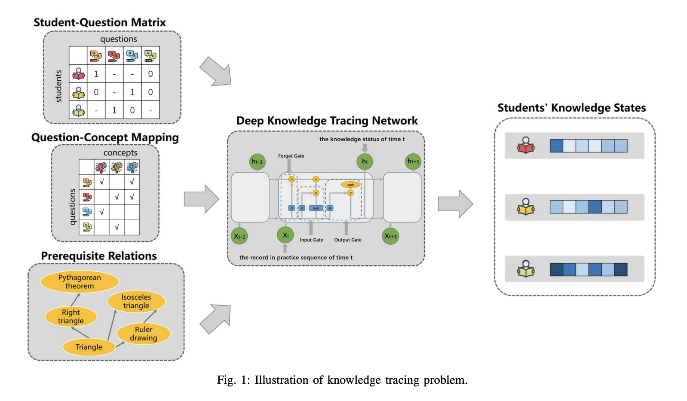
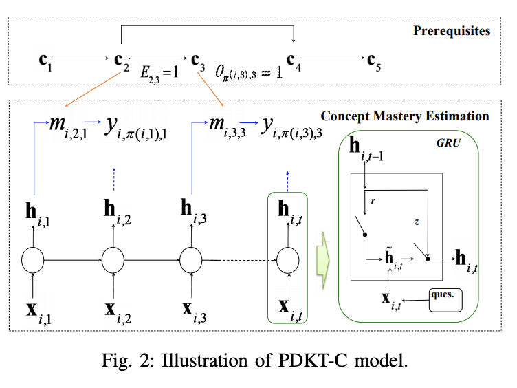
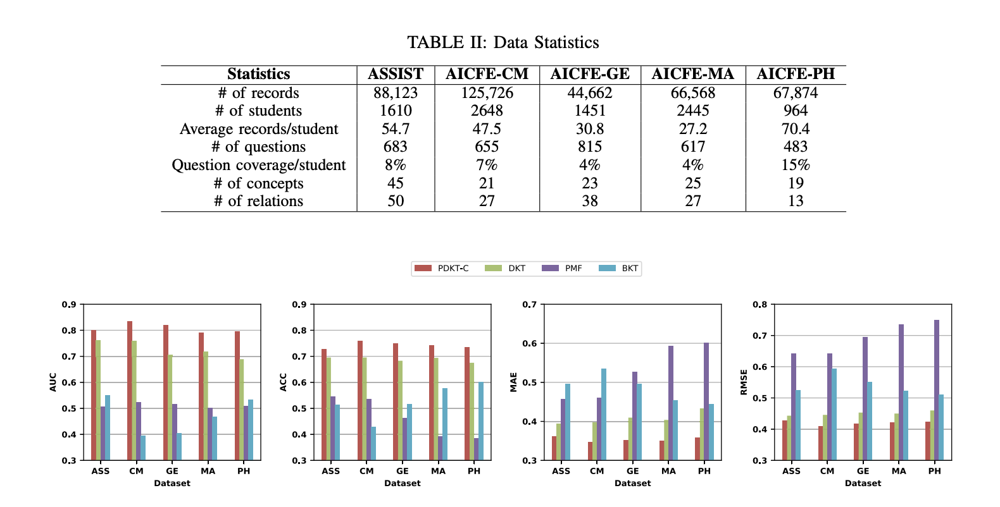

## Prerequisite-Driven Deep Knowledge Tracing
### Penghe Chen, Yu Lu, Vincent W. Zheng, Yang Pian 
### ICDM 2018 [[arXiv](https://aic-fe.bnu.edu.cn/docs/20190108101850881476.pdf)]

**Whats Unique**
This paper presents a new loss function to accomodate concepts pre-requisite constraints in deep knowledge tracing model.

**How It Works**
* Following figure illustrates the system diagram

    
    <em>Source: Author</em>
    

* Following figure presents the architecture

    
    <em>Source: Author</em>
    

* Concept mastery are computed by applying sigmoid on dot product of hidden state and concept embedding

    

* Correctness is predicted by taking product of concept mastery

    

    

* Updated loss function with the constraint of pre-requisite concepts are as below

    

**Results**
* PDKTC has been applied on various open datasets and it has outperformed SOTA results

    
    <em>Source: Author</em>
    

