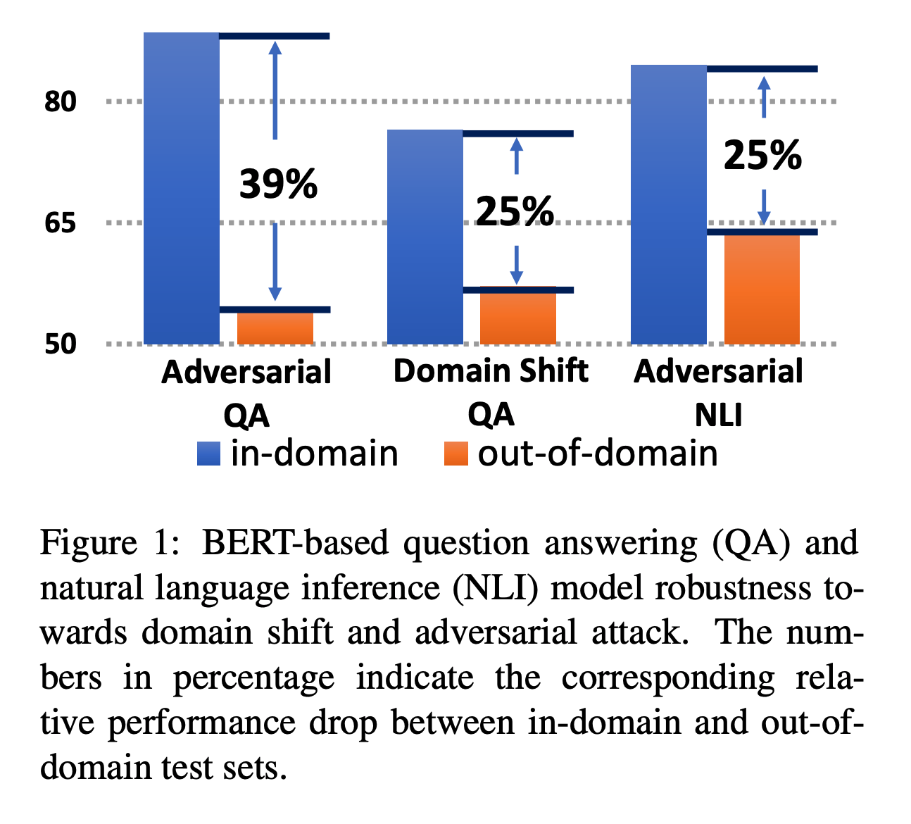
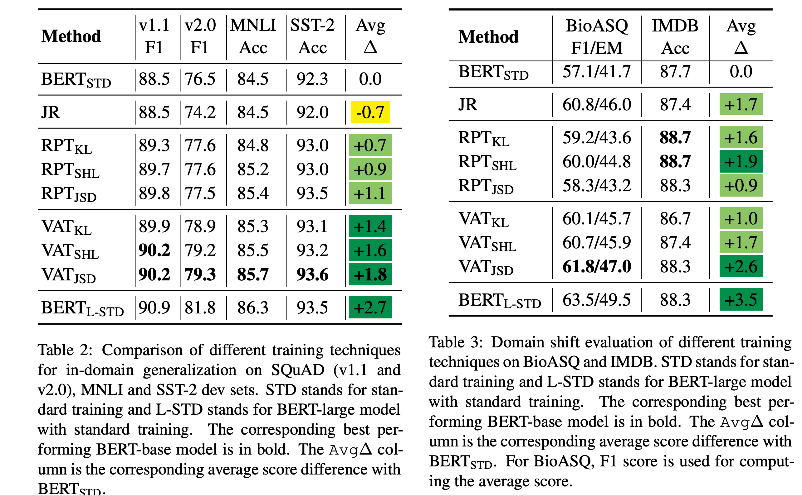

## Posterior Differential Regularization with f-divergence for Improving Model Robustness.
### Cheng, Hao, Xiaodong Liu, Lis Pereira, Yaoliang Yu, and Jianfeng Gao. 
### arXiv preprint arXiv:2010.12638 (2020) [[arXiv](https://arxiv.org/pdf/2010.12638.pdf)].

**Whats Unique**
This paper focus on the impact of methods regularising the model posterior difference between clean and noisy inputs. Theoretically, it provides connection of two methods, Jacobian Regularisation, and Virtual Adversarial Training. 

**Motivation**
* Following figure shows the downfall on the performance when a model is applied to out of domain or adversarial in-domain attack.

**Adversarial Learning**
* It focus on minimizing the following objective:

    

**Posterior Differnce Regularisation**
* It focus on regularising the difference in the posterior.
    
    

* Where PDR funciton R can be either Jacobian Regularisation, or it can be Virtual Adversarial Training.

* Jacobian Regularisation:
    * First order taylor approximation would give following input-out jacobian matrix:

    

    * It can be shown theoretically, that to reduce overall sensitivity of model to input perturbations, directly Frobonius Norm of Jacobian matrix can be mininised (considered as R). Which is:
        * 

* Virtual Adversarial Training
    * The objective to minimize the impact of input perturbations is, 

    

    * Where, KL is the kullback divergence

* Author shows that f-divergence is a family of various posterior difference regularisation functions like KL, or Jacobian regularisation. 

* On the tasks, of NLI, and QA, papers shows the improvement by these regularisation methods in out-of-domain and adversarial attack settings.

**Results**

