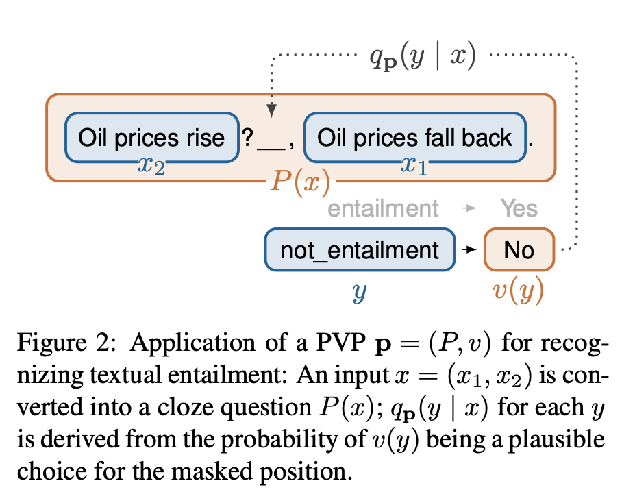

## It's Not Just Size That Matters: Small Language Models Are Also Few-Shot Learners
### Schick, Timo, and Hinrich Schütze. 
### arXiv preprint [[arXiv:2009.07118](https://arxiv.org/pdf/2009.07118.pdf)] (2020).

**Whats Unique**
This paper laid out how an efficient pattern exploiting training (PET), which updates parameters with the few shots learning and distillation can outperform three order complex model like GPT-3. It experiments with SuperGLUE.

**How It Works**
* It maps each task into Cloze MLM tasks. It comes up with PVP, pattern-verbalizer pair (PVPs) to map input to a masked token cloze question, and output to a single token representing task specific meaning. Following figure shows the illustration:

* It is challanging to identify PVP for a given task. So, it enables the combination of multiple PVPs. For each PVP p, a MLM is fine tuned on training examples (x, y) using cross entropy loss.

* The ensemble of finetuned MLMs is used to annotate a set of unlabelled examples using soft weights.

* The resulting soft-lablled dataset is used train a regular sequence classifier by minimizing the cross entory between output and predicted label using soft labels.

* It creates a new dataset FewGLUE from SuperGLUE, where it uses 32 labelled examples, and upto 20000 unlabelled examples, and using ensemble of multiple PVPs it comes up with the soft labelled dataset. Which is then used to train a regular classifier. It outperfoms GPT-3 model on most of the SuperGLUE tasks.

