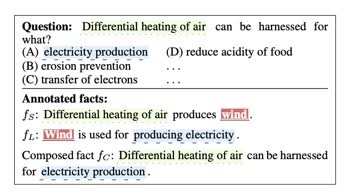
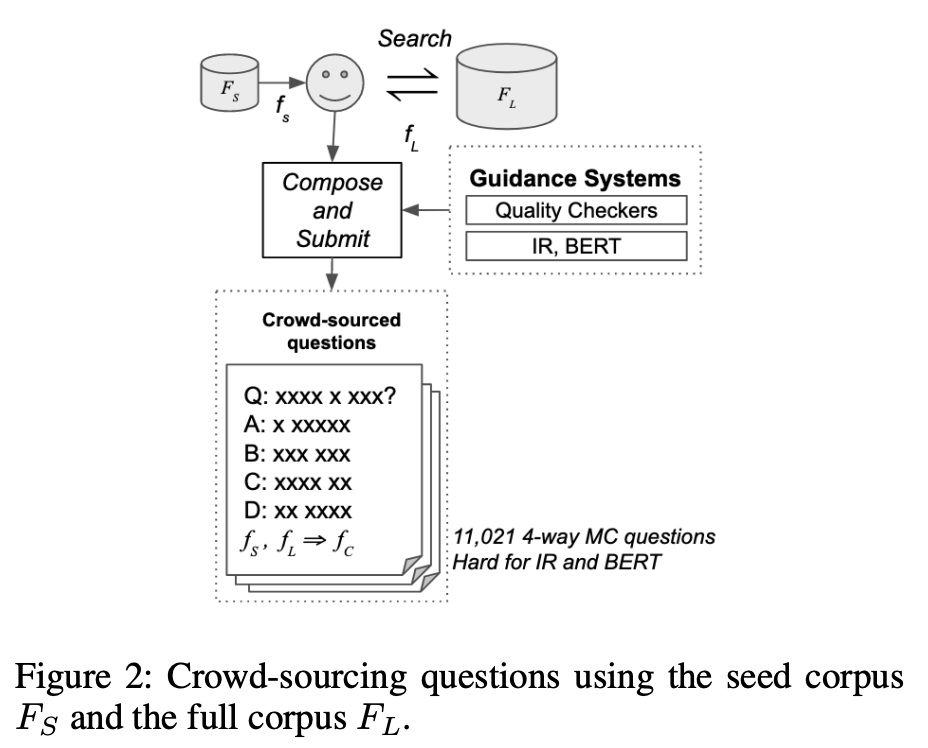
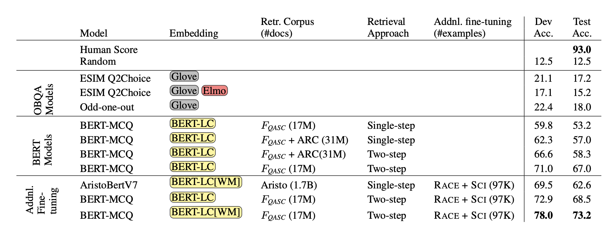

## QASC: A Dataset for Question Answering via Sentence Composition.
### Khot, Tushar, Peter Clark, Michal Guerquin, Peter Jansen, and Ashish Sabharwal.
### AAAI. 2020.

**Whats Unique**
This paper presents a dataset for two-hop question answering associated with corpora of 17 millions academic facts. It describes the method to generate the distractors. It also provides the strong baseline with BERT using retrived context and fine tuned on similar datasets. 

**How It Works**
* This dataset has a question which is not so obvious to way to decompose question in to two questions.
* A sample question, along with two facts, and combined fact are given as below:

    
    <em>Source: Author</em>
    

* Questions are generated using crowd-sourcing as follow:

    
    <em>Source: Author</em>
    

* Baseline model training:
    * Two step IR:
        * Retrieve facts using q+a
        * Retrieve four more facts for each retrived facts using search query which contain atleast one word from Q\f1 and f1\Q
        * Keep facts that do not contain any word from q and a
        * Select top M facts sorted by IR score
    * BERT model training, with the retrieved facts as context.
    * Distractor generator
        * Distractor option should be true option for some other question.
        * Generate distractor where atleast one model thinks it is a better answer than a given answer.
        * Annotate distractors using crowd source approach.
    * Fine tuning on the similar QA datasets.

    
    <em>Source: Author</em>
    

    
