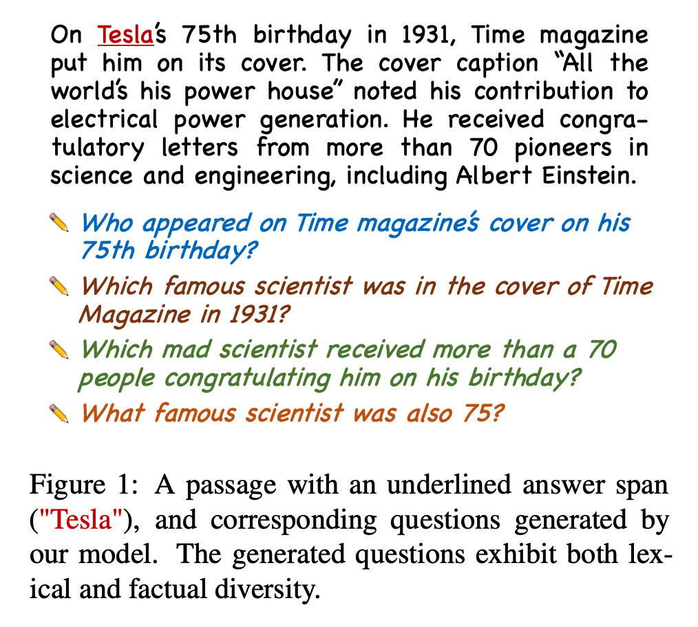
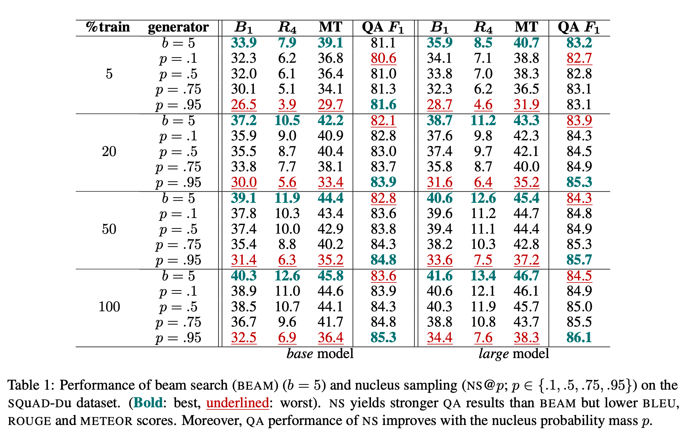
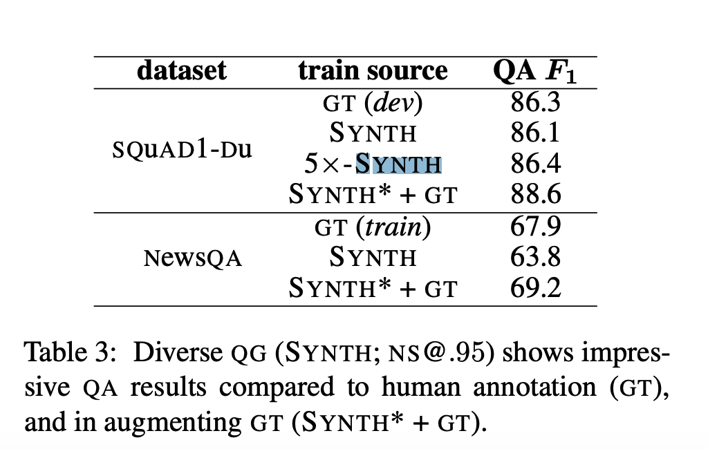

## On the importance of diversity in question generation for QA.
### Sultan, Md Arafat, Shubham Chandel, Ramón Fernandez Astudillo, and Vittorio Castelli.
### In Proceedings of the 58th Annual Meeting of the Association for Computational Linguistics, pp. 5651-5656. 2020.[[arXiv](https://www.aclweb.org/anthology/2020.acl-main.500.pdf)]

**Whats Unique**
Author demonstrates that question generation using top-p nucleus sampling gives generate more diverse questions, and it provides better QA training. And, also BLEU, METEOR, ROGUE are inversely correlated with diversity.

**How It Works**
* Following example shows how different question can be created from an unique answer span.

<em>Source: Author</em>

* Top-p nucleus method samples from re-normalised categorical distribution P_N of nucleus N, which is samllest subset of vocabolary items that has a commulative probability mass greater than p. and highest probability among all the subsets. 
* By restricting the pool to a high likelihood region of vocabolary instead of top-k sampling, NS reduces the chances of generating low-probability items.

* First, 8 QG models are trained, 4 base and 4 large models. And, depending on the volume of training data. 
* Quetions on dev data were generated using QG models, which were used to train QA model, which were then tested on the test data.

* We can see the results as below, which compares beam search and NS@p (neclues sampling at probability mass p)

<em>Source: Author</em>

* NS@.95 on QG model trained with 100% of data has given much better results then the on with beam search.

<em>Source: Author</em>

