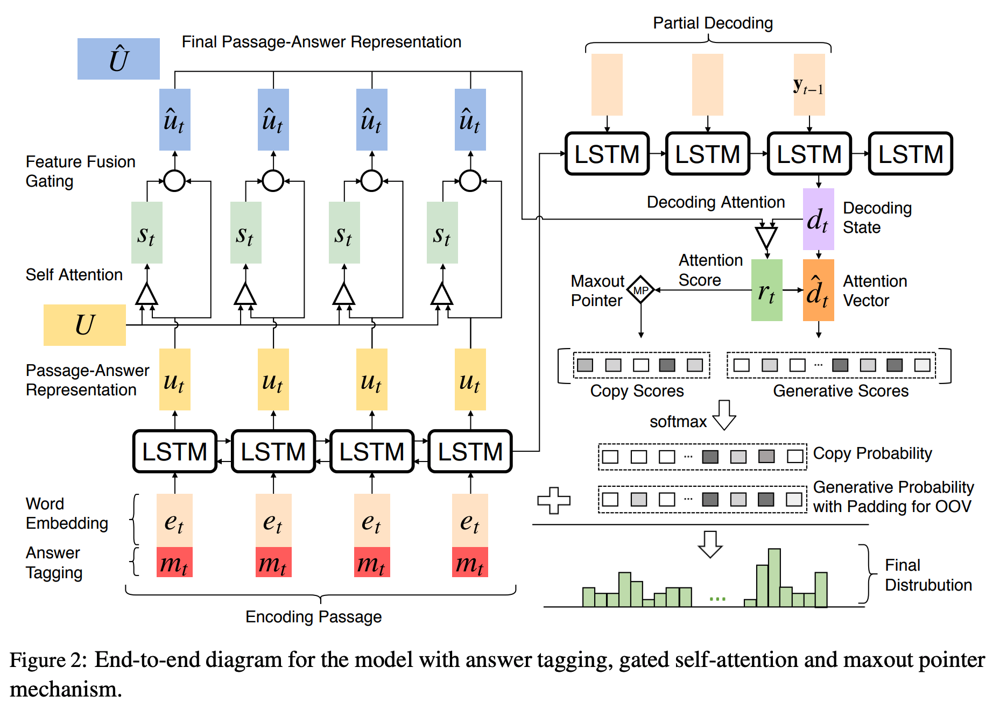
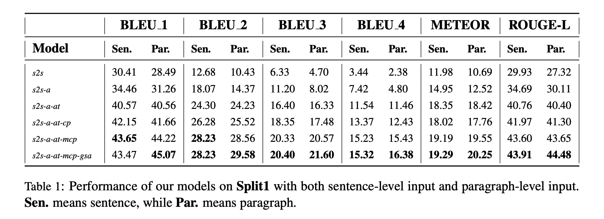

## Paragraph-level Neural Question Generation with Maxout Pointer and Gated Self-attention Networks
###  Yao Zhao, Xiaochuan Ni, Yuanyuan Ding, Qifa Ke
### ACL 2018 [[arXiv](https://www.aclweb.org/anthology/D18-1424.pdf)]

**Whats Unique**
This paper presents new techniques - maxout pointer and self attention encoder - to use longer sequence as context while generating text using copy/pointer networks. It focuses on answer-aware approach using sentences or paragraphs as inputs.

**How It Works**
* Problem Definition: Given paragraph and answer we need to generate a question. 

    

    * Word generated in Q are either from input passage, or from a vocabulary V.

* Following figure illustrate the architecture really well:
    

        
        <em>Source: Author</em>
        
 

* The attention encoder output is generated as follow:
    * **Gated self attention** has two steps:
        1.  self matching represenation (f_t) by taking encoded passage-answer represenation (u) and conducting matching with itself (U).
        2. combining input (u) with self matching represenation (f_t) using a feature fusion gate.

    

* Decoding with without attention and without max-out pointer:

    

* Decoding with attention and without max-out pointer

    

* Decoding with Copy/Pointer

    

* Decoding with max/out pointer

    

* scores of SC_copy can be appeneded to generative score d_t, which then can be fed together to softmax to generate the output. Independently, SC_copy and d_t can independently passed to softmax, and output is picked from one of them using another dynamic weight learned.

* Results: In the following ablation study, it demonstrate how each architectural design has impacted performance positively.

    
    <em>Source: Author</em>
    

