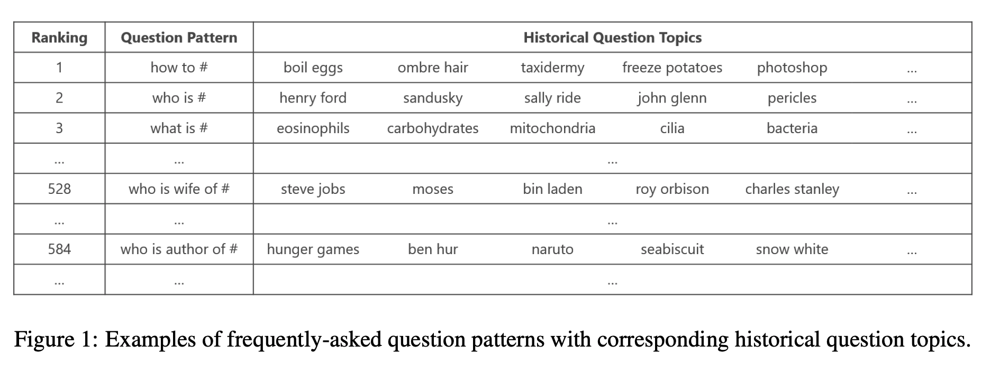

## Question Generation for Question Answering
### Nan Duan, Duyu Tang, Peng Chen, Ming Zhou
### EMNLP 2017 [[arXiv](https://www.aclweb.org/anthology/D17-1090.pdf)]

**Whats Unique**
This paper present a pipeline for question generation using techniques from classical datamining, machine learning, attention, and deep learning. 

**How It Works**
It generates questions using pipeline of the following modules.
1. Question Pattern Mining
    * It mined questions from various datasets, to generate question patterns, i.e. “who founded # ?”, where one word/phrase from question is made replaced by special word. And, the masked phrase becomes question topic.
    

    
    <em>Source: Author</em>
    

2. Question Pattern Prediction
    * Retrieval based approach: Question pattern is predicted with an attention based neural network with the following loss function, where S is paragraph and Q_p is question pattern. It minimise the distance of positive question pattern and maximise the distance of negative question pattern from the paragraph. 
    
    * Generative approach: Question pattern is generated based on the passage S with the generative loss function as follow:
    
3. Question Topic Selection:
    * Retrieval based appraoch: Confidence of Q_t extracted for Q_p from passage S is given as below. Where, Q_p^tk are historical question topics. and N = Sum(#Q_p^tk for all k)

        

    * Generative approach: Neural approach use the question topic with maximum attention which was computed to generate question pattern

        

4. Question Ranking
    * Using labelled data, a linear model is trained to predict the rank of the question genrated, i.e. question pattern + question topic. It uses features like question pattern prediction score, question topic selection score, QA matching score, word overlap between question Q and passage S, question pattern frequency etc.

5. Question generation for QA
    * It select the best question for the best answer which maximise the probability of "generating a question given that answer, multiplied by probability of answer given that question".

        

* Results:
    * It has computed BLEU score for both retrieval based method and generative mehthod for SQUAD, MSMarco, and WikiQA. And, for retrieval methods, BLUE scores are around 8-10%, and for generative methods they are around 11-13%.
