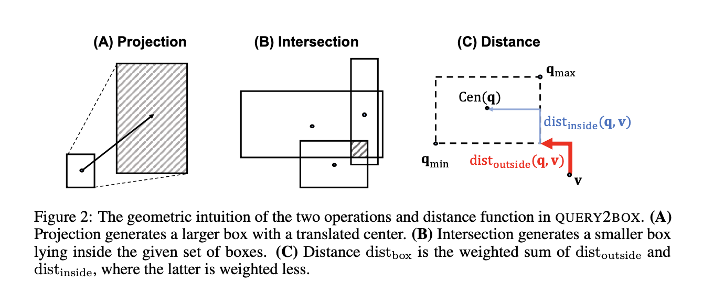

## Query2box: Reasoning over Knowledge Graphs in Vector Space using Box Embeddings
### Hongyu Ren, Weihua Hu, Jure Leskovec
### ICLR 2020 [[arXiv](https://arxiv.org/pdf/2002.05969.pdf)]

**Whats Unique**
This paper presents an approach where query is transformed as box embeddings, and projections for each relations are learned, and thier intersection (i..e. like venn diagram intersections) operations is also learned. Further, it shows any query can be transformed as DNF, where disjunction can be the last operation in computation graph.

**How It Works**
Query2Box has mainly following steps
* Query Q - Dependency Graph
* Computation Graph Construction
* DNF: Disjunctive Normal Form
* Knowledge Graph Embedding Training
** entity embeddings
** projections for each relation
** intersections training for boxes
** Objective function for training

* Following figure illustrate how query2box works?
    
  
    
    <em>Source: Author</em>
    

* Following figure illustrate the three main innovation of Query2Box
** Projection for each relation
** Parameteric intersection
** Distance function to leverage box embeddings

  
    
    <em>Source: Author</em>
    

* Results: it has given over 25% relevative improvement on MRR metric for KG operations over datasets like FB15k, FB15k-237, NELL995
