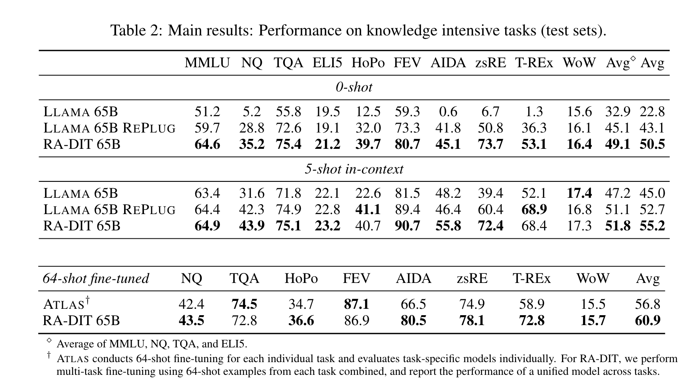

## Ra-dit: Retrieval-augmented dual instruction tuning.
* Lin, X. V., Chen, X., Chen, M., Shi, W., Lomeli, M., James, R., ... & Yih, S. (2023). 
* arXiv preprint arXiv:2310.01352 [[PDF](https://arxiv.org/pdf/2310.01352)]

# Key Points
* Retrieval augmented langauge models (RALMs) improve performance by accessing long-tail and up-to-date knowledge. 
* Existing approach to RALMs is (i) Retriever specific modifications to LM pre-training. (ii) post-hoc integration of data-store.
* RADIT mainly has
    * fine tunining pre-trained LM to better use retrieved information. 
    * fine tuninig retreiver to return more relevant results
* RALM improves 0-zhot performance by around 8.9% and 1.4% in 5-shot settings.
* Retriever uses DRAGON+ - a state of the art dense encoder model trained with contrastive learning objective. 
* Chained Objective: Retreival and Generation.
* 

# Language model fine tuning: 
* for each (x,y) record, it fetches top 5 contexts, and for each context, it generate a training pair (y, (c, x)). 
* 

# Retriever fine tuning:
* learn KL divergence function for each context c:  

* where, $p_{LSR}$ is generalized version of LM-Supervised Retrieval, Shi et al., 2023b.
* 

<em>Source: Author</em>

 

