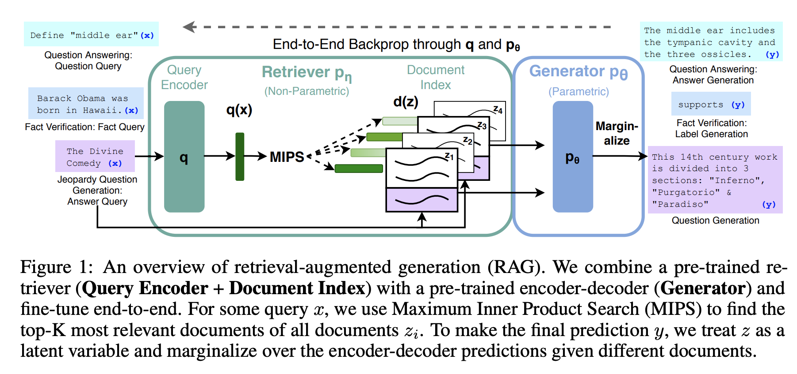

## Retrieval-Augmented Generation for Knowledge-Intensive NLP Tasks
### Piktus et al, Facebook AI Research, NYU
### NIPS 2020 [[arXiv](https://arxiv.org/pdf/2005.11401.pdf)]

**Whats Unique**
This paper proposes and validate that pre-trained models with a differentiable access mechanism to explicit nonparametric memory can perform better on knwoledge intensive tasks with a general purpose fine tuning recipe (RAG). 

**Whats RAG**
RAG: Retrieval Augmented Generation is a general purpose fine tuning recipe to combine pre-trained parametric and non-parametric memory for language generation. 

**How It Works**
Architecture diagram for RAG is shown below.

    
    <em>Source: Author</em>
    

RAG model use the input sequence x to retrieve text passages z and use these passages as additional context when generating the target sequence y.

It has following main components:
* Retriever:
    * Given a query x, it retrieve top-K passages z.
* Generator:
    * Given a query x, passages z, it generates a token sequence.

Two different RAG architectures are hypothesised and validated.
* RAG-sequence model: It fix a document and generate the token sequence.

    
    * It uses "Thorough Decocoding" (for any sequence using a passage, it would also compute proabilities over other passages), and "Fast Decoding" (for any sequene from a passage, if that sequence is not among beam search outputs from other passages, it would be assumed 0). 

* RAG-token model: It runs in auto-regressive mode, where at each token it attend over all the documents.

    

* DPR (Dense Passage Retrieval) is used for retrieval, and BART is used as a generator.

**Results**
- Over closed book, open book, extractive and abstractive question answering, and other NLP tasks it does produce good results.

