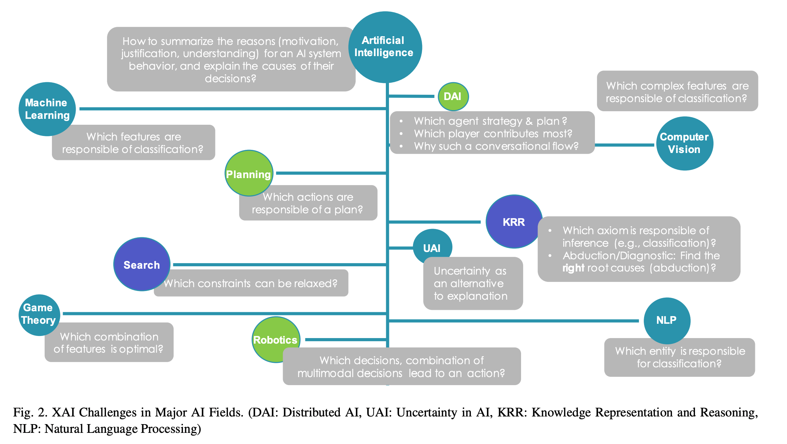
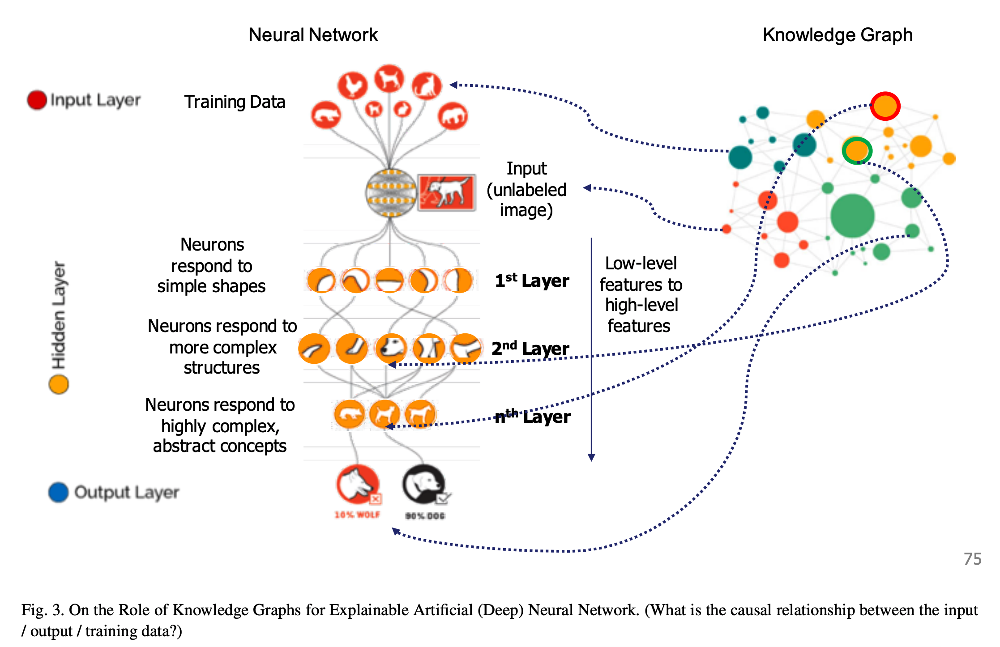

## On the role of knowledge graphs in explainable AI.
### Lecue, Freddy
### Semantic Web 11, no. 1 (2020): 41-51. [[PDF](http://www.semantic-web-journal.net/system/files/swj2198.pdf)]

**Whats Unique**
This is a survey paper, showing how the field of aritificial intelligence is progressed from explainability point of view, and what are limitations and what knowledge graphs can offer?

* Knowledge graph encodes contexts, expose connections and relations, and support causation and inference natively.

<em>Source: Author</em>

* Machine Learning: 
    * XAI is mainly about explanation of model and explanation of prediction:
    * Some models are naturally designed to explicit their rational, like linear regression, naive bayes, decision trees etc. 
    * Techniques such as features importance, partial dependency plot, or individual conditional expactation can be used.
    * Limitation and Opportunity: Exaplnation beyond correlation, and KG can be useful as it supports causation and inference natively.

* Artificial (Deep) Neural Network
    * XAI is maninly about global and local explanations.
    * Current approaches are mainly to get feature importance, attention mechanism, or local explanations through a surrogate model. 
    * Limitations and Opportunity: Explanations are mainly based on where network is focusing on, it do not represent any logic of learning task. Architectures needs to be designed to natively encode explanation, capturing hierarchical relationship, causality mechanisms. KG can help to make sure model learns hierarchies, causality and explainable representations.

* Computer Vision
    * XAI is to mainly identify pixels, group of pixels responsible for trigerring shape detection, or uncertainity.
    * Saliency maps, gradients, network dissections are current approaches for the explainability.
    * Limitations and Opportunities: Although saliency map expose interesting visualization artifacts, they do not capture any semantics. KG could expose the semantics of such dientangled representation.

    

    
    <em>Source: Author</em>
    

* Constraints Satisfaction and Search:
    * Finding a solution under a set of constraints.
    * XAI challange is to identify which constraint to relax and why its the proper decision. 
    * Backtracking, constraint propagation, and local search are its examples of such approaches. NP complete problem.
    * Limitations and Opportunities: search space is its limitation, and any structure in its problem representation has benefited the search. Knowledge driven structure could dynamically adapt to variables, constraints and search space. KG can also drive semantic relations between constraints.

* Game Theory:
    * Its the study of mathematical models of strategic interaction between rational decision makers.
    * Challange is to indentify underlying mathematical model as well as its properties. Shapely value is a solution concept in Game Theory which is used to capture the influence of a player in a game settings.
    * Limitations and Opportunities: Similar to the domain of constraints satisfaction and search, the limitation is the search space, KG can provide a structure and organize features, and reducing the search space and potentially improve understanding and readability of explanations.

* Uncertainity in AI
    * Uncertainity in AI is at the frontier of various AI fields namely knwoledge represenation, learning and reasoning. Bayesian probability and Probablistic Graphical Models are ususally central for representing and reasoning with uncertainity.
    * XAI challanges are mainly around probablistic dependencies of the multivariate data. Some XAI approaches transform PGM into weighted logical formulas to tightly decouple constraints and dependencies from probablist params.
    * Limitations and Opportunities: PGM are appropriate representations to connect inter-dependable data, dependencies remains probablistic. Semantic represenation and connections throgh knowledge graphs could be used to disambiguate and force latent variables to represent interpretable content.

* Robotics
    * Use of robots, and computer systems for their control, sensory feedback, and information processing. 
    * XAI Challanges around the rational of coordination in multi robots systems and swarms. Fusion of explanation coming from underlying systems.
    * Limiations and Opportunity: justifying actions and decisions and integrating explanations from multiple interacting systems needs human interpretation. KG have been designed to capture knowledge from hetrogenous domains making them a great candidate to achieve explanations.

* Distributed AI:
    * Related to multi agent system, which also makes representation, structure, system which could make AI scalable.
    * XAI challanges are focusing on explaining and resolving agent conflicts based on their intention and beliefs. Current XAI approaches involve replaying the decision with a variant of the original situation. These approaches are close to counter-factual and case-based reasoning.
    * Limitations and Opportunity: Ontology is core representation layer for agents to communicate and negotiate. It is rarely used for explaining agent behavior. Dynamics of agent interactions can be captured more formally, and embedded with broader common sense knowledge to identify human interpretable explanation. 

* Automatic Planning and Scheduling
    * XAI challanges in planning are explaining (i) casual relationships of actions, (ii) why some actions in particular situations (iii) why plans are better than some (iv) why plans could not be computed (v) why replaning might be required
    * Limitations and Opportunity: exaplantions to link decision and situation, KG can better contexualize complex domain specific terms and summarize complex actions in more succint and meaningful way.

* Natural Langauge Processing:
    * How to program computers to process human languge data. 
    * XAI challanges is to identify the feature importance, or explaining the reseoning in sequence of dialogues etc.
    * Limiations and Opportunity: XAI approches suffers from statistics based explanations, mainly co-occurance and correlation. KG could provide a missing semantic layer.

