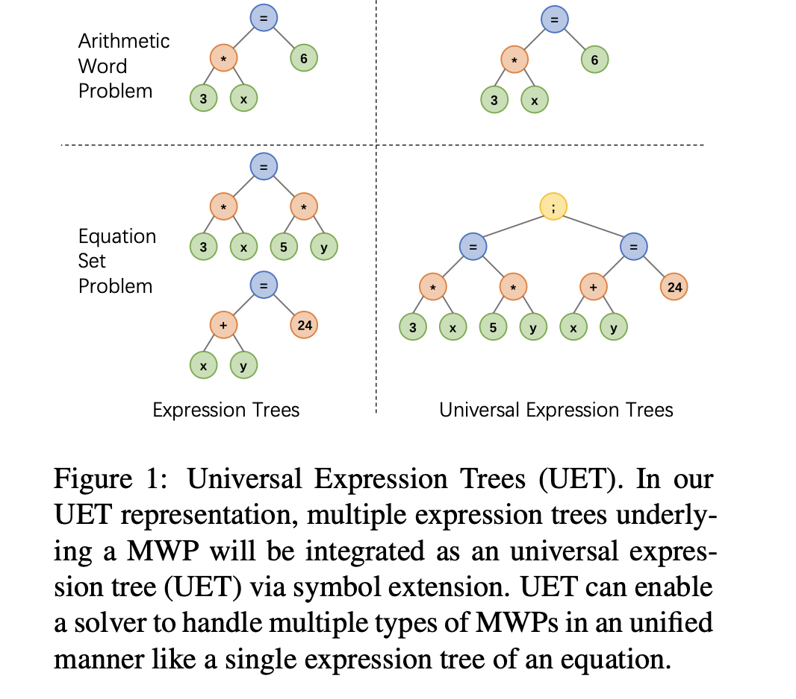
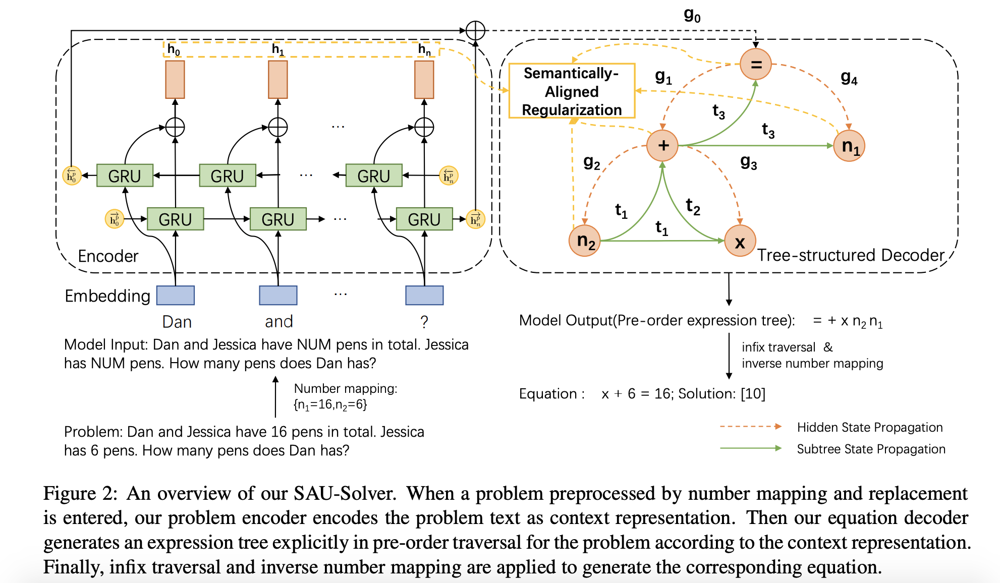

## Semantically-aligned universal tree-structured solver for math word problems.
### Jinghui Qin, Lihui Lin, Xiaodan Liang, Rumin Zhang, and Liang Lin. 2020.
### In Proceedings of the 2020 Conference on Empirical Methods in Natural Language Processing ([EMNLP](https://aclanthology.org/2020.emnlp-main.309.pdf)), pages 3780–3789.

**Whats Unique**
This paper brings three novelties, 1) Universal Expression Tree to handle multiple equations, 2) New challanging Hybrid Math Word Problems dataset, 3) Semantically algined new tree-structure decoder.

**How Does It Work**
* Universal Expression Tree: As can be seen in the figure below, different equations are concatenated in the tree with the special symbol ";". It also introduces multiple unknowns like x, y etc.

<em>Source: Author</em>

* Semantically aligend Tree-structued decoder: SAU Solver
As shown in the figure below, a new token is generated by attending its parent, or subtree from the sibling and attention weighted encoder represnetation on the problem. 

<em>Source: Author</em>

* Semantically aligned regularization: It generates attention weighed encoder representation for a subtree representation. It transforms both into a vector space, where they should be semantically aligned.

    

* It demonstrates the improvement across different datasets like HMWP, ALG514, Math23K, Dolphin18K etc.
