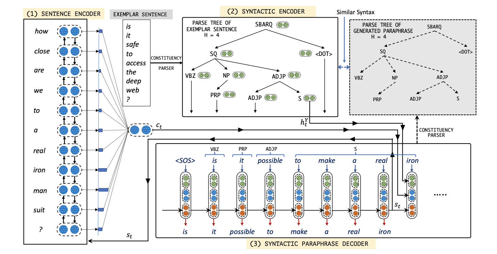
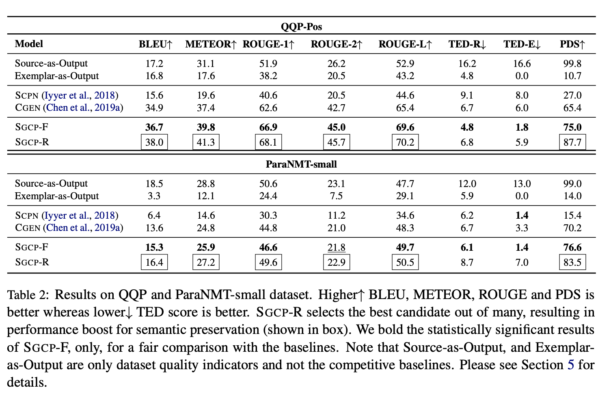
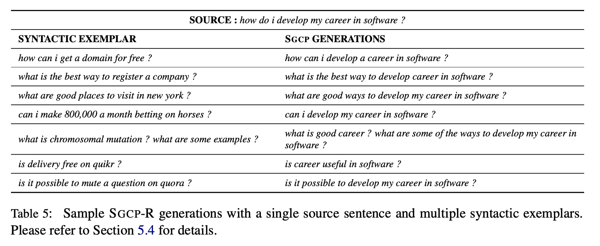

## Syntax-guided Controlled Generation of Paraphrases
### Ashutosh Kumar, Kabir Ahuja, Raghuram Vadapalli, Partha Talukdar, 
### ACL 2020 [[arXiv](https://arxiv.org/pdf/2005.08417.pdf)]

**Whats New** This paper invent a technique to paraphrase an input sentence in a controlled manned with guided syntax. 

**Major Contribution**
* An end-to-end model to generate syntactically controlled paraphrases at different level of granularity using a syntax parsed exemplar.
* New mechanism to incorporate syntactic information from exemplar sentence's syntactic parse. 
* Dataset formed from Quora Question Pairs for evaluating models. And, set of extensive experiments to prove validity.

**How It Works**
* SGCP has following major modules:
    * Inputs
        * Input sentence X
        * Syntactic Exemplar Y (with leaf node removed)
    * **Semantic Encoder**
        * 
        * e(x_t) is embedding of x_t
    * **Syntactic Endoder**
        * Let constituency tree,  
        * V is set of nodes, E is set of edges, and Y the labels associated with each node.
        * Using technique similar to TreeLSTM, 
        
        * Syntatic tree is randomly pruned at height from {3,.., H_max}
        * Queue of terminal nodes of syntactic tree is maintained. L_H^Y
            

    * **Syntactic Paraphrase Decoder**
        * 
        * X is input sentence, and Y is exemplar sentence

            
            
    * **Using Semantic Information**

        

    * **Using Syntactic Information**

        

    * **Objective Function**

        

    * Following figure illustrate it really well. 
        

        
        <em>Source: Author</em>
        

* Results
    * SGCP is well evaluated on two different aspects, paraphrase should retain the meaning, and it should also have syntactic structure.
        

        
        <em>Source: Author</em>
        

    * BLUE, METEOR, ROUGE-1, ROUGE-2, ROUGE-3 - are evaluaion to measure semantic correctness.
    * Tree-edit distance is used to measure syntatic distance.
    * PDS - is Phraphrase detection score, is the performance of quora paraphrase classifiers. 
    * SGCP examples for different exemplars can be found as below.
        

        
        <em>Source: Author</em>
        

