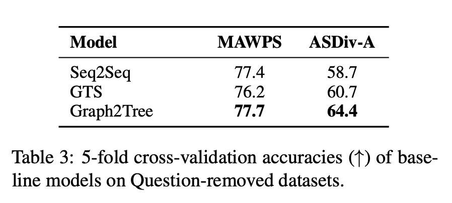

### Are NLP Models really able to Solve Simple Math Word Problems?.
### Patel, Arkil, Satwik Bhattamishra, and Navin Goyal.
### arXiv preprint [[arXiv:2103.07191](https://arxiv.org/pdf/2103.07191.pdf)] (2021).

**Whats Unique**
This paper presents how limited the capability of NLP models to solve math word problems. And, it exposes how models are learning heuristics and other counter intuitive patterns to solve problems. This paper generates an another adversarial dataset SVAMP which is more robust and the accuracy of such models on this dataset is moderate. Hence lot of actual work needs to be done on this problem.

**Key Points**
* Authors have applied SOTA seq2seq and Graph2Tree Model on MAWPS dataset and found that very high accuracy can be attained. They have removed question altogether from the input, and being dependent just on the question, they could still get very close accuracy, that means models are learnig other patterns and heuristics and not dependent on the actual reasoning ability. Following two tables illustrate the point:

    
    <em>Source: Author</em>
    

    
    <em>Source: Author</em>
    

* Even constrained model, i.e. without LSTM based encoder, or neighter using attention mechanism, it just used FFN as the encoder model. Author got relatively good accuracy, which once again question the numerical reasoning capability of the model.

* Analysing attention weight has revealed that model focus on few words like "each", "every" and generate sequence accordingly. Questionable reasoning.

* Authors have taken 100 centroid questions, and produce 10 variations for each question to come up with a hard dataset of 1000 questions. These variations are as below: 

    
    <em>Source: Author</em>
    

* Reasonably lower accuracy of 43.8 on this new SVAMP dataset, and constrained model now actually gives accuracy near to majority template baseline. This reinforce that it is still hard problem to solve.

