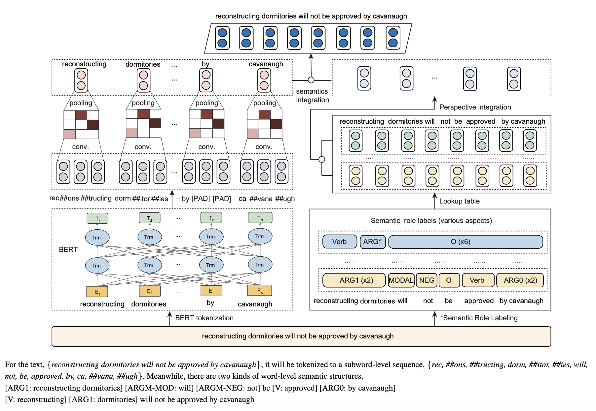
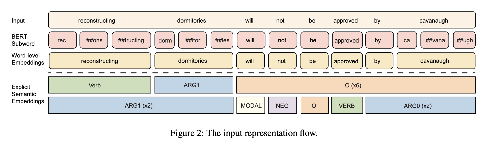

## SemBERT: Semantics-aware BERT for Language Understanding
### Zhuosheng Zhang et al. 
### AAAI 2020 [[arXiv](https://arxiv.org/pdf/1909.02209.pdf)]

**Whats Unique**
This paper integrate semantic representations form Semantic Role Labelling and BERT word level representation, and it outperform BERT for classification and NLI tasks.

**How It Works**
* Following two figures illustrate the strategy and example.

* Architecture

    
    <em>Source: Author</em>
    

    
    <em>Source: Author</em>
    

**Semantic Role Labelling**
* Semantic role labelling is "who did what to whom".
* Each sentence is annotated into several semantic sequences
* Pre-trained SRL module (Peters et. al. 2018) was used to predict all predicates and corresponding arguments in one shot. It has 84.6% F1 score on OntoNotes v5.0 for CoNLL-2012 shared task

**Ablation Study**
* SemBERT has outperformed BERT as well as simple concatanation of BERT and semantic label represetnations.