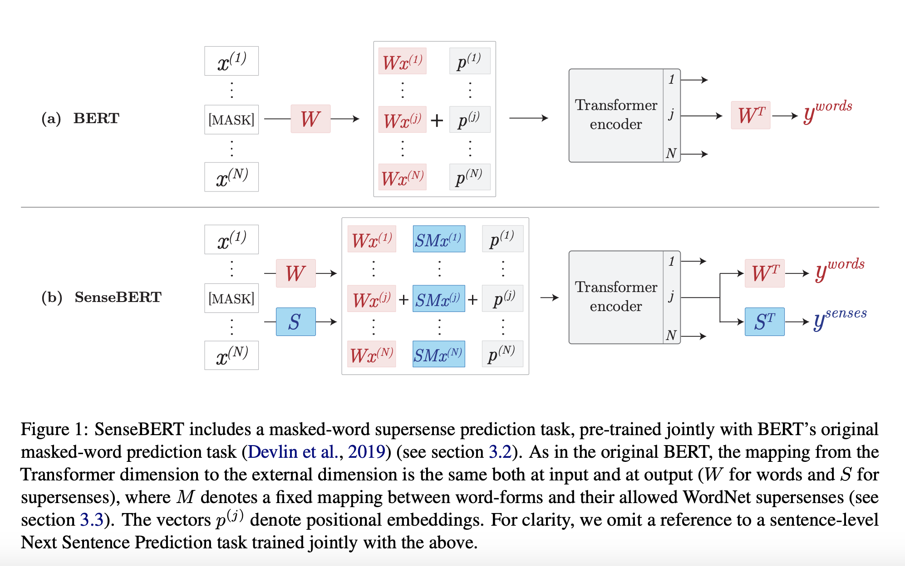
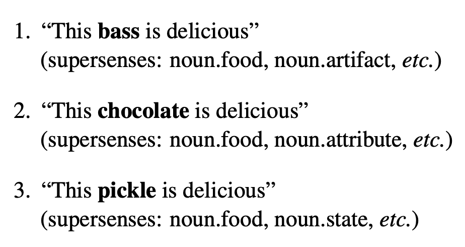
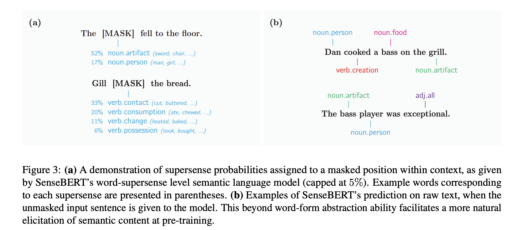

## SenseBERT: Driving Some Sense into BERT
### Yoav Levine et al. AI21 Labs, 
### May 2020 [[arXiv](https://arxiv.org/pdf/1908.05646.pdf)]

**Whats Unique**
This paper present a technique to predict super-sense of the masked word, with the help of weak supervision by infusing supersense of the words during pretraining. And, it surpasses state of the art results for WiC task of SuperGLUE.

**How It Works**
* It has selected set of 45 supersenses as the candidates for infusion in weak supervision as well as for prediction.
* Following figure layout the diagram for architecture
    

        
        <em>Source: Author</em>
        

* Following example illustrate the concept of **weak supervion**
    

        
        <em>Source: Author</em>
        

* Sense-language-modelling: Allowed senses prediction

    

* Sense-language-modelling Regularisation

    

* SLM Loss function
    

* Following figure shows an example of how it predicts supersenses for masked words as well as for unmasked sentence.
    

        
        <em>Source: Author</em>
        

**Results**
* It has shown 2.5% improvement for WiC task.