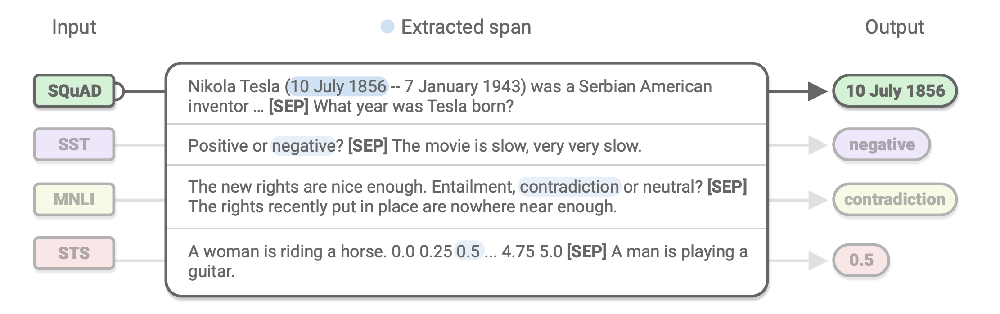

## Unifying Question Answering, Text Classification, and Regression via Span Extraction
### Nitish Shirish Keskar, Bryan McCann, Caiming Xiong, Richard Socher
### Sep 2019

**Whats New**
This paper transforms regression, and classification tasks also as the span extraction, i.e. similar to question answering. And it demonstrate the impact of intermediate training and better transfer of inductive bias as a result.

**Major Takeaways**
* Span Extraction is an effective approach for unifying question answering, text classification, and regression.
* Span Extraction can also leverage intermediate training effectively, and it pass on benefits to classification and regression tasks.
* Span extractive multi tasks learning yield stronger multi tasks models. 

**How It Works**
* Following figure illustrate the approach of unifying regression, classification and question answering as span extraction problem.

    

        
        <em>Source: Author</em>
        

* It adds two trainable parameters vectors d_start and d_end, specifically to learn the possible range of start and end, and then detecting span in that range.

    

    * where, X_sf is the output from top layer of transformer.

    

**Results**
* With intermediate training on Squad and MNLI, it has achieved better results over GLUE tasks as well.
* Similarily, Multi-task model also followed same trend, where best joint single model was intermediate trained on MNLI->Squad, and then to all differnt tasks.

