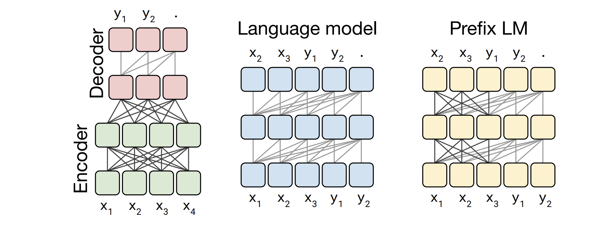

## T5: Exploring the Limits of Transfer Learning with a Unified Text-to-Text Transformer, Raffel et al, Google, 2019

Summary: 
* Introducing an **unified framework** that convert every NLP problem into text-to-text format.
* Comparative study of pre-training objectives, architectures, unlabelled datasets, transfer approaches, and other factors over dozen language understanding task (GLUE and SuperGLUE).
* A database **C4 "Colossal Clean Crawled Corpus"**, (750 GB) created from Common Crawl project, which produces around 20TB text extracted from web each

Details:
* Denoising objective by corrupting sequence 
* Instead of using sinosudial positional embedding, T5 uses a simplified form of positional embedding which are learnt, and  each embedding is simply a scalar that is added.
* T5 models share positional embedding across each layer
* T5 model is trained on cloud TPU v3 pod with 1024 cores.
* Task specific prefix is added to input before feeding it to the model, 
    * “translate English to German: That is good.”
    * “mnli premise: I hate pigeons. hypothesis: My feelings towards pigeons are filled with animosity." 
* There is a significant overlap between WSC and WNLI, hence T5 was not trained explicitely on WNLI and neither it was reported on the same.

<em>Source: Author</em>

Experiments:
* **Learning Rate:**
 where k is number of warm up steps and n is current iteration
* **Training:** Sequence: 512, Batch: 128 => 65536 tokens (or,  tokens)
* **Total pretraining** for  steps which would constitute  tokens i.e. 34B. This is only fraction of C4 data.
* **Vocabolary:** 32000 wordpieces. And, sentencepiece model to accomodate non english languages.
* **Unsupervised Objective:** denoising objective to predict missing or corrupted token, consecutive sequence of such missing tokens are replaced by sentinel tokens. 
* **Language Model:** Encoder-decoder Transformer architecture use fully visible mask in encoder, and causal mask in decoder, but in text-to-text tasks, input and output are concateneted, and language models are used for that, i.e. BERT encoder architeture. In that case, there is need of Prefix LM, where input part of the sequence should be fully attended, and output should be casually masked.

<em>Source: Author</em>

