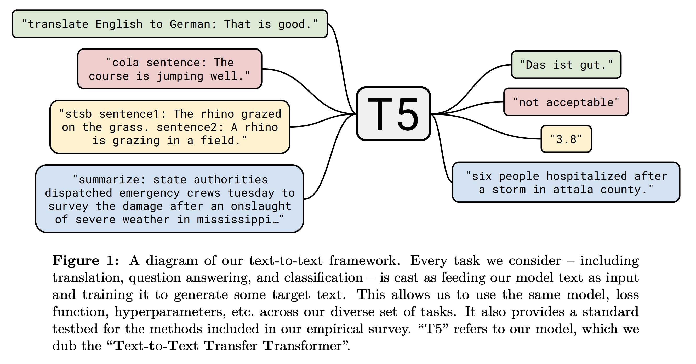

## T5: Exploring the Limits of Transfer Learning with a Unified Text-to-Text Transformer, Raffel et al, Google, 2019

Summary: 
* Introducing an **unified framework** that convert every NLP problem into text-to-text format.
* Comparative study of pre-training objectives, architectures, unlabelled datasets, transfer approaches, and other factors over dozen language understanding task (GLUE and SuperGLUE).
* A database **C4 "Colossal Clean Crawled Corpus"**, (750 GB) created from Common Crawl project, which produces around 20TB text extracted from web each

Details:
* Denoising objective by corrupting sequence 
* Instead of using sinosudial positional embedding, T5 uses a simplified form of positional embedding which are learnt, and  each embedding is simply a scalar that is added.
* T5 models share positional embedding across each layer
* T5 model is trained on cloud TPU v3 pod with 1024 cores.
* Task specific prefix is added to input before feeding it to the model, 
    * “translate English to German: That is good.”
    * “mnli premise: I hate pigeons. hypothesis: My feelings towards pigeons are filled with animosity." 
* There is a significant overlap between WSC and WNLI, hence T5 was not trained explicitely on WNLI and neither it was reported on the same.

<em>Source: Author</em>

