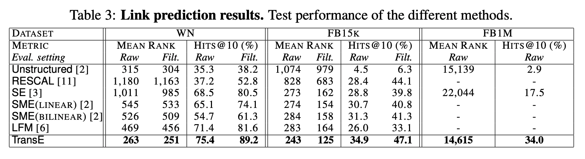
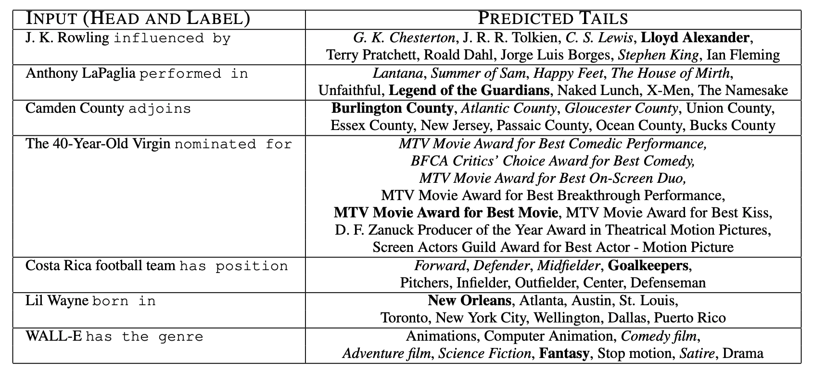
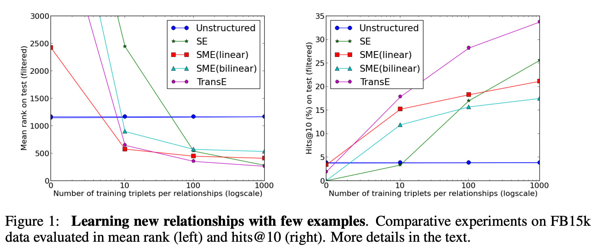

## Translating Embeddings for Modeling Multi-relational Data
### Antoine Bordes, Nicolas Usunier, Alberto Garcia-Duran
### NIPS 2013 [[arXiv](https://papers.nips.cc/paper/5071-translating-embeddings-for-modeling-multi-relational-data.pdf)]

**Whats New** It proposes a simple and effective way for modeling relations as translation of head to tail using low dimensional embeddings.

**How It Works**
* It minimize following margin baed loss:
    
    * d is disimilarity measure, and h', t' are corrupt triplets. corrupt entries are created as below: 

    

* It experimented on two databases, Freebase and Wordnet.
    * Evaluation criteria:
        * It removes head, and instead evaluate disimilarity between h'+l, and t for all entities as h'. 
        * Arrange all entities h' as per score
        * It measures the rank of correct entitiy h = h'
        * It also tracks hits @ top-10

    * Results shows that TransE has outperformed current SOTA techniques.
        

        
        <em>Source: Author</em>
        

    * Also, perforamnce across 1-1, 1-Many, Many-1, and Many-Many was also encouraging.
    * Few examples of the tail entities predicted are, 
        

        
        <em>Source: Author</em>
        

    * It also demonstrated capability of transfer learning, by splitting the data into two parts (keeping entities covered, but relationships are partinitoned). TransE was better among the candidates.
    

        
        <em>Source: Author</em>
        

