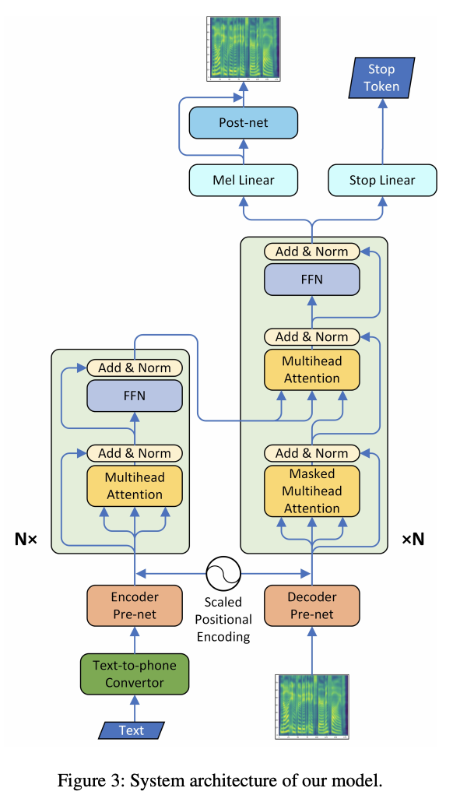

## Neural speech synthesis with transformer network.
### Li, Naihan, Shujie Liu, Yanqing Liu, Sheng Zhao, and Ming Liu. 
### In Proceedings of the AAAI Conference on Artificial Intelligence, vol. 33, no. 01, pp. 6706-6713. 2019.[ (AAAI)](https://ojs.aaai.org/index.php/AAAI/article/download/4642/4520)

**Whats Unique**
This is transformer based text-to-speech speech synthesis model. It improves training time in comparison to then state of the art RNN based Tacotron2 model.

**How It Works**
* Tacotran2 is RNN based, which has the problem of low efficiency in training and inference, also it is hard to model the long range dependency.
* Speech Synthesis Architecture:
    * Text -> Phoneme Sequence
    * Phoneme Sequence -> Transformer TTS
    * Transformer TTS -> Mel Spectrogram
    * Mel Spectogram -> Wavenet Vocoder
    * Wavenet Coder -> Audio

* TransformerTTS first converts text to phonemes, and it learns embeddings for each phonemes.
* Since input to encoders are phonemes, and inputs to decoder are mel-spectogram, it projects them into same vector space using CNN based Encoder Pre-Net and Decoder Pre-Net.
* Decoder outputs mel spectogram, which is then fed to CNN based Post-Net to finetune further.
* Decoder also outputs STOP token, which uses binary cross entropy with higher weightage to "stopping" class (as there is a class imbalance problem, i.e. STOP token would be true only at the end of the generated sequence)

* Architecture diagram is as follow:

    
    <em>Source: Author</em>
    

* Ablation study shows, 
    * 6 layers has better score instead of 3 layers. 
    * 8 attention heads in each layer has better score than 4 attention heads
    * Learnable parameter to add positional embedding vary as the training progress, in both encoder and decoder.