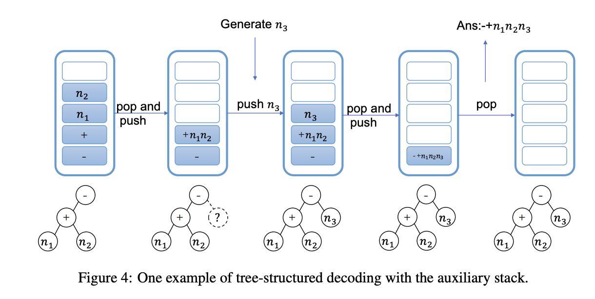
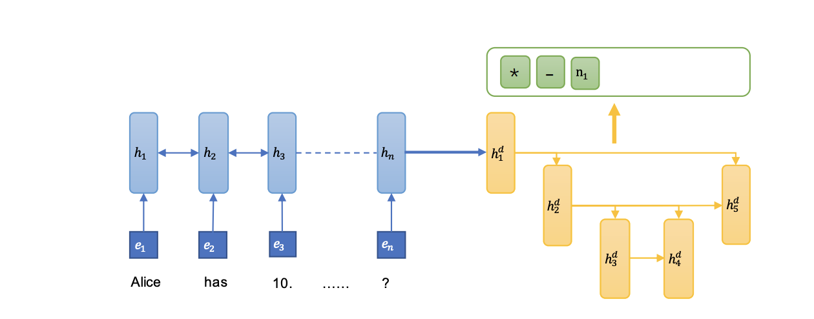

## Tree-structured decoding for solving math word problems.
### Liu, Qianying, Wenyv Guan, Sujian Li, and Daisuke Kawahara.
### In Proceedings of the 2019 Conference on Empirical Methods in Natural Language Processing and the 9th International Joint Conference on Natural Language Processing (EMNLP-IJCNLP), pp. 2370-2379. 2019. [PDF](https://aclanthology.org/D19-1241.pdf)

**Whats Unique**
The main innovation this paper bring is to leverage stack datastructure for the tree decoder to use concatenaned representation of hidden state of parent, the token representation of sibling and previous token. 

**Key Points**
* It preprocess the data by significant number identification
* It normalize the equation to a shortest equation, and order of number tokens is kept as it appears in the problem text, if and when possible.
* It uses pre-fix order equation template before using to train them
* It leverage stack data structure to retrieve embeddings and representations for sibling and parent.

    
    <em>Source: Author</em>
    

* The framework of our seq2tree model is as follow:

    
    <em>Source: Author</em>
    

