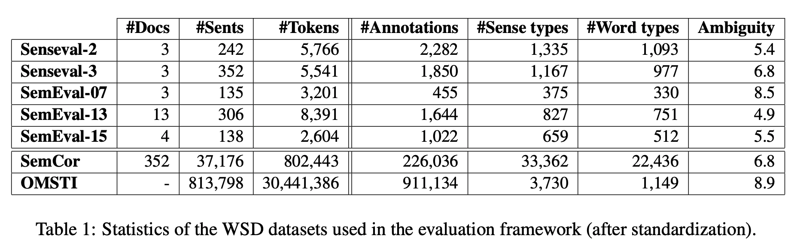
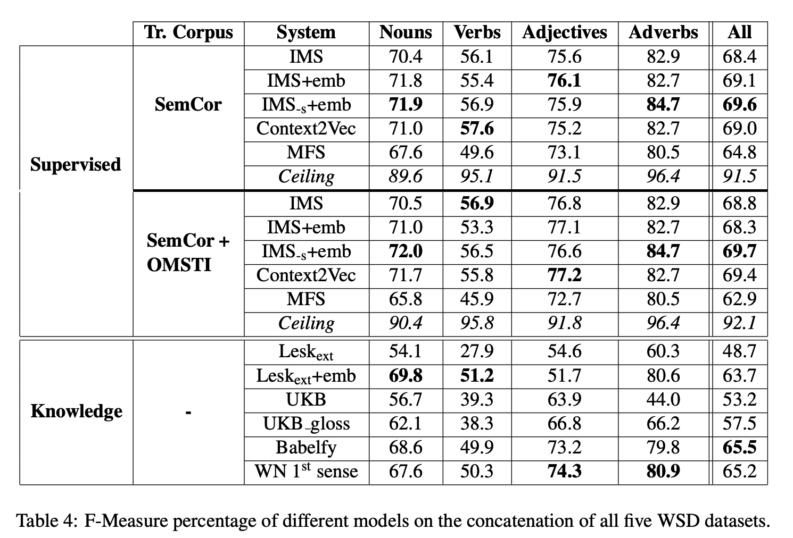
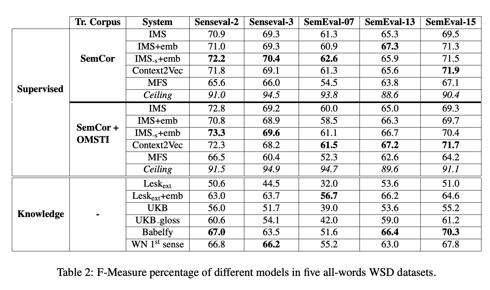

## Word Sense Disambiguation: A Unified Evaluation Framework and Empirical Comparison
### Alessandro Raganato, Jose Camacho-Collados and Roberto Navigli
### ACL 2017 [[arXiv](https://www.aclweb.org/anthology/E17-1010.pdf)]

**Whats New**
This is an unified framework from data, set of techniques for comparision, and evaluation techniques for the problem of word sense disambiguation problem.

**Main Contribution**
1) Complete evaluation framework for word sense disambiguation
    * standardising WSD datasets and training corpora
    * semi automatically converting sense annotations to WordNet 3.0
    * preprocessing the dataset by consistently using the same pipeline
2) Emperical comparision of techniques proposed in WSD literature.

**Stats on different WSD datasets are as below**
* We can see the stats of datasets as below. Note, SemCor and OMSTI are training corpora.

    

        
        <em>Source: Author</em>
        

    
    * OMSTI dataset is automatically constructed by using alignment based WSD approach.

** Evaluation of techniques 
* There are two different types of techniques, 1) supervised and 2) knowledge based.
* Supervised:
    * IMS: SVM classifer over a set of conventional WSD features, i.e. surrounding words, POS of surrounding words, local collocations etc
    * IMS+embeddings: word embeddings as features in WSD. Two configurations, including and excluding surrounding words. (exponential decay to weight surrounding words)
    * Context2Vec: 
        * Bidrectional LSTM trained on unlabelled corpus
        * Context vector is learned for each sense annotation.
        * Sense annotation whose context vector is closer to the target word's context vector is selected as the intended sense.
* Knowledge based:
    * Lesk: overlap between definition and context words
    * UKB: page rank algo over semantic network initialised using context of the target word.
    * Babelfy: Semantic network integrating wordnet and other resources like wikipedia, wiktionary. Algo is based on densenet subgraph heurisitc. To construct the subgraph itnot only take target word but the whole input document.

* Results:
    * Results of supervised and Knowledge based techniques are as below. Two variants of supervised techniques, i.e. trained on SemCor only and on both SemCor + OMSTI.
    

        
        <em>Source: Author</em>
        

    * Results per pos-tag and all combined together are available as below. Note, verbs are most difficult to sense correctly, also because they have highest ambiguity. 

    

        
        <em>Source: Author</em>
        

