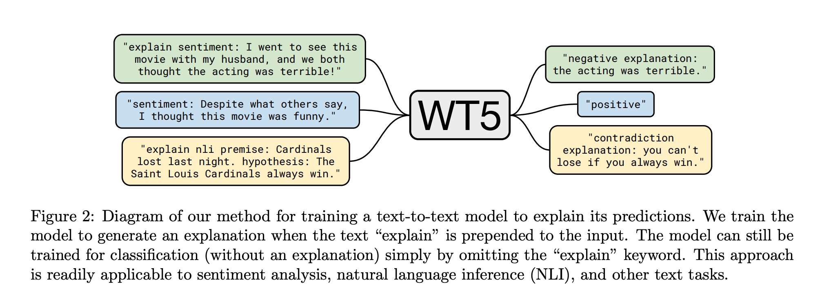

## "WT5?! Training Text-to-Text Models to Explain their Predictions."
### Narang, Sharan, Colin Raffel, Katherine Lee, Adam Roberts, Noah Fiedel, and Karishma Malkan.
### arXiv preprint arXiv:2004.14546 (2020).[[arXiv](https://arxiv.org/pdf/2004.14546.pdf)]

**Whats Unique**
Authors present the extension of T5 model to generate explnations as well. And, also demonstrate how it is transferable across datasets, and to some extent across tasks.

**How It Works**

    
    <em>Source: Author</em>
    

* During training WT5 model, (acronym for Why? T5), "explain" is prepend
* Explnations are generated followed by prediction, and after the token "explanation:"

* Following figure shows the result fo WT5 model:

    
    <em>Source: Author</em>
    

