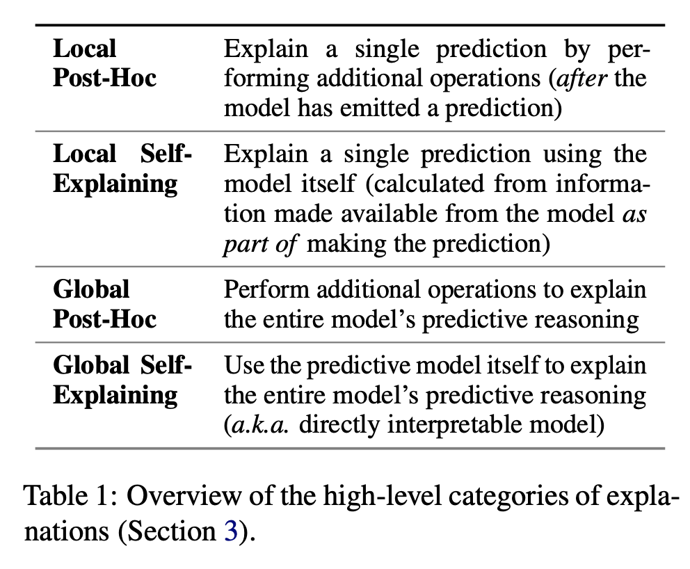
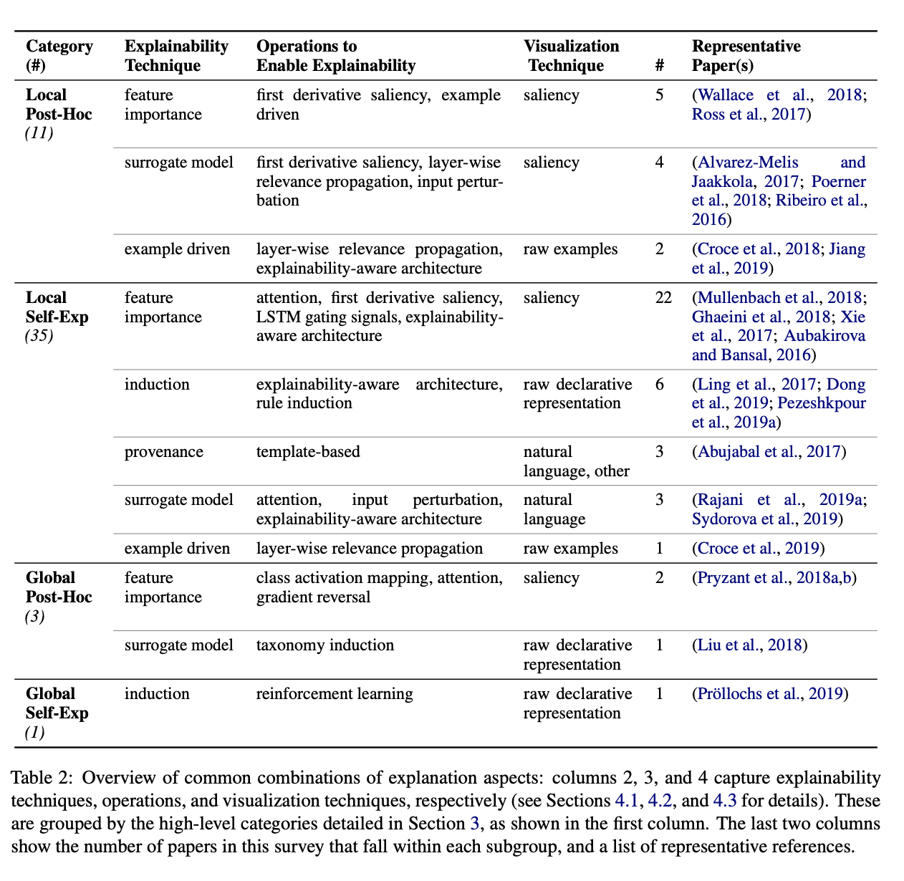
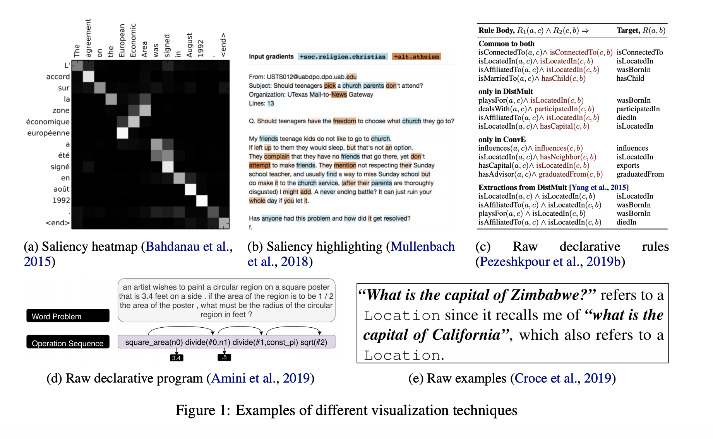

## A Survey of the State of Explainable AI for Natural Language Processing
### Marina Danilevsky, Kun Qian, Ranit Aharonov, Yannis Katsis, Ban Kawas, Prithviraj Sen
### [[arXiv](https://arxiv.org/pdf/2010.00711v1.pdf)]

**Whats Unique**
This paper presents a survey of state of the art research for generating explantions, it provides a taxonomy and classify around 50 papers into the same.

**Details**

* Following figure lays out the taxonomy in which explainability techniques are classified.

    
    <em>Source: Author</em>
    

* Following figure further compiles details on each of these categories.

    
    <em>Source: Author</em>
    

* Following figure presents the visualisation techniques available

    
    <em>Source: Author</em>
    

