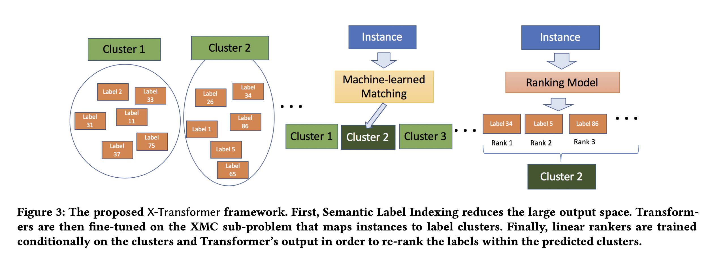

## Taming Pretrained Transformers for Extreme Multi-label Text Classification
### Wei-Cheng Chang, Hsiang-Fu Yu, Kai Zhong, Yiming Yang, Inderjit S. Dhillon, 2020
### [[arXiv](https://assets.amazon.science/32/d7/bb602e97419ead030dde419b9191/taming-pretrained-transformers-for-extreme-multi-label-text-classification.pdf)]

**Whats Unique**
This paper presents a technique for extreme multi label classification using transformers. It first clusters the labels, then cluster classification using transformer, and ranking using one-vs-all binary classifers.

**How does it work**

    
    <em>Source: Author</em>
    

* It learns a score function between an instance x, and label l as follow:

    

    * g(x, c_l) is transformer fine tuned to map instance x to a cluster l [Nerual Matcher]
    * h(x, l) is one vs all classifier trained for positive instances x and l, and negative instances of x in cluster where l belongs. [Ranking]

**Semantic Label Indexing**
* label representation is derived either from a label or the instances belonging to the label.
*  They are clustered using hierarchical classification of tree with K leaf nodes.

**Deep Transformer as Neural Matcher**
* Square hinge loss is used to train nerual matcher. 

    

**Ranking**
* Teacher Forcing Negatives (TFN): only those instances which belong to same cluster.
* Matcher aware negatives:  instances from top-b predicted clusters.
* OVA (one-vs-all) classifer with binary loss is used.

**Results**
* It produces state of the art results.