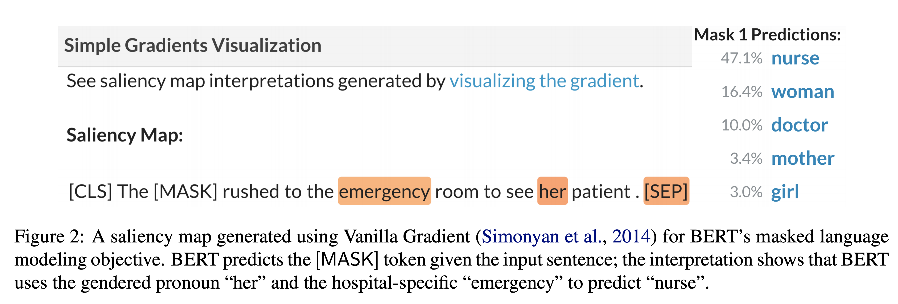

## AllenNLP Interpret: A Framework for Explaining Predictions of NLP Models
### Wallace et al.
### Allen Institute of Artifical Intelligence
### EMNLP, 2019

**Whats new** An open source framework for interpreting NLP, and get insights. 

**Key features**
* Saliency maps: This is to interpret why the model made its prediction? Models on output is used as a lable to compute the loss. And, then gradient is computed based on few methods
    * Vanilla gradiets: Gradient of loss with respect to each token.
    * Integrated Gradients: Integration of gradient along the path of "absence of information" to original input. 
    * Smooth Gradients: Average gradients on noisy versions of input.

    
    <em>Source: Author</em>
    

* Adversaial attacks
    * Untargeted and Targeted Fliphops: To answers questions like *"how would the prediction change if certain words are replaced?"* or *"what words should be swapped in order to cause a specific prediction?"*?
    * Input Reduction: How many words can be removed without changning the prediction?