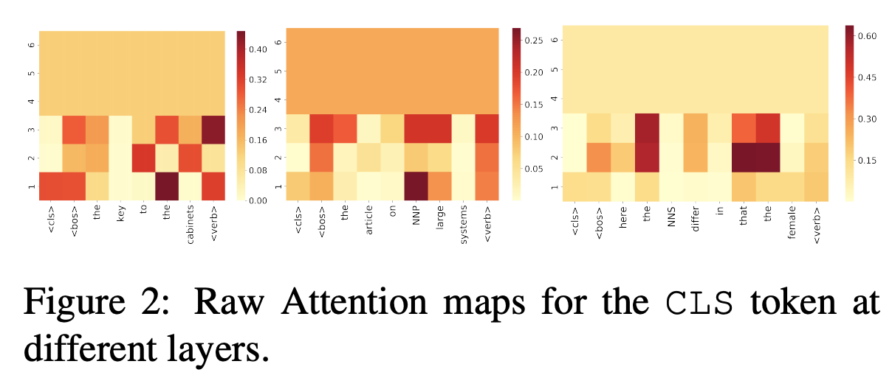
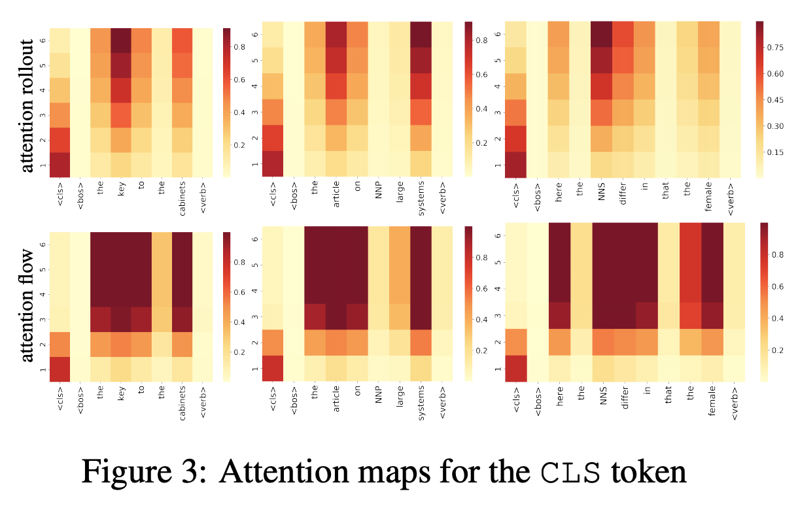

## Quantifying Attention Flow in Transformers
### Samira Abnar, Willem Zuidema
### ACL, 2020

**Whats New** Attention weights in transformer gets increasingly mixed. This makes attention weights unreliable. This paper proposes two methods of approximating the attentions to input tokens, attention rollout and attention flow. And, it shows higher correlation with importance score obtained using ablation and input gradients.

**How is it done**
* Attention Rollout
    * 
    * Basically, it unmix information, and actually measure how much actual attention goes to a particular token.
    * i.e. Attention of token 3 on token 2 in two layer would be
        * Attention(3, 2) = Attention_l2(3, 1) * Attention_l1(2, 1) + Attention_l2(3, 2) * Attention_l1(2, 2) + Attention_l2(3, 3) * Attention_l1(3, 1)

* Attention flow: 
    * Each edge between nodes can be considered as attentions, and it adheres two constraints
        * Attention weight should be below capacity
        * Input flow and output flow should remain equal for a node
    * Designing attention graph as flow network
        * Capacities are attention weights
        * And, maximum attention flow algorithm computes maximum attention from any node to any node.

* Analysis:
    * In BERT, CLS token would attend to different tokens in sentence for a task.
    * Author selected task of predicting verb number prediction (i.e. singular / plural)
    * Raw attention maps can be seen in figure below:
        

        
        <em>Source: Author</em>
        

    * Where as, attention rollout and attention flow weights can be seen below, which are far more intuitive then raw attention:
        

        
        <em>Source: Author</em>
        

    * SpearmanR correlation with importance computed with input gradient was computed and it was higher for Attention Flow followed by Attention Rollout. 