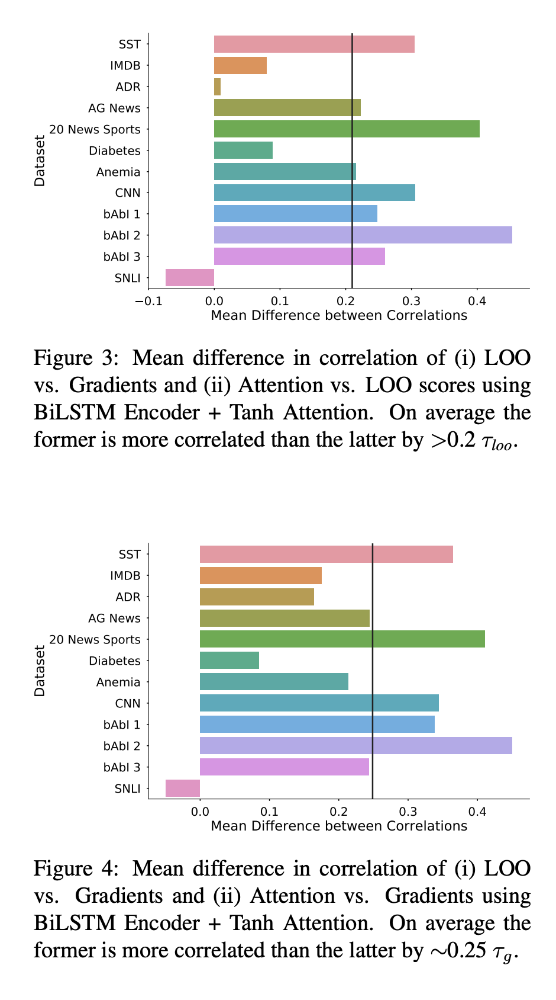
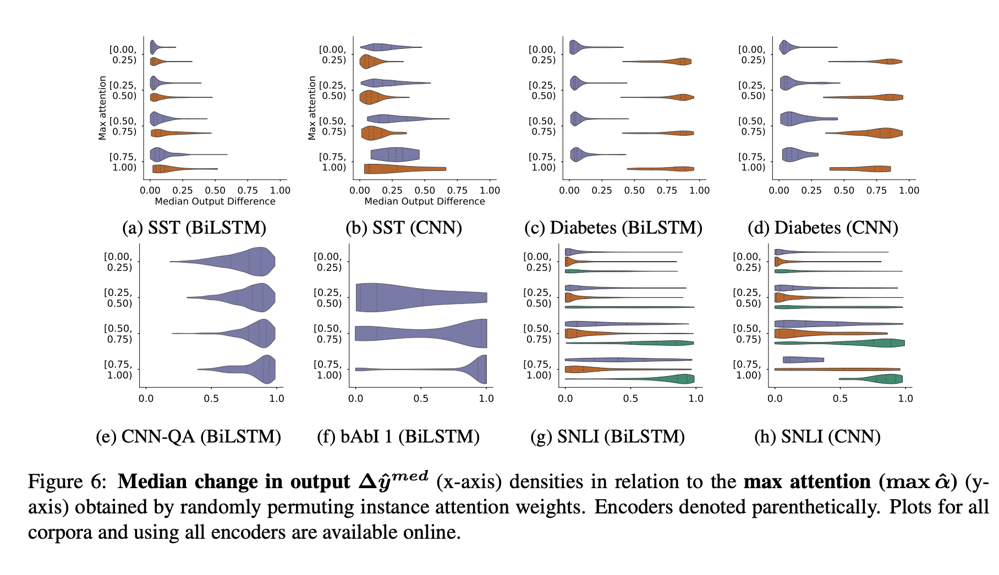
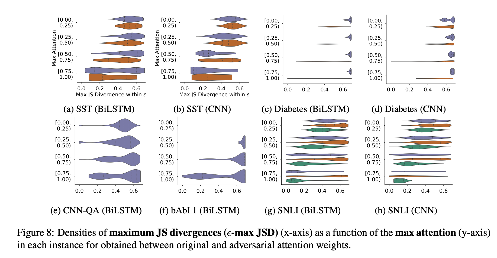

## Attention is not Explanation
### Sarthak Jain, Byron C. Wallace
### Northeastern University
### NAACL-2019

**Whats new** This paper analyze that "are attention weights plausible and faithful explanation of prediction", and it found out it is not directly considered as explanation. 

**How it works**  It mainly carries two deeper analysis
1. Correlation between Attention and Feature Importance:
    * It has considered two reference feature importance methods, 1) gradient based, 2) leave-one-out method
    * **LOO as reference**
        * It compared difference in correlation between 1) LOO vs Gradients, 2) LOO vs attention weights. It found out that LOO vs attention weights has lesser correlation, mean difference is about 0.2

    * **Gradient as reference**
        * It compared difference in correlation between 1) Gradients vs LOO, 2) Gradients vs attention weights. It found out that Gradients vs attention weights has lesser correlation, and mean difference is about 0.25
    * **Gradient as reference**

    

    
    <em>Source: Author</em>
    

2. Counterfactual Attention Weights: Attention Permutation
    * Take permutation of attention weight, and check how median of predictions changes. We can see in figure below, that inspite of having max attention weight much higher, its permutations are in the high density of causing minimal impact in median output difference.

    

    
    <em>Source: Author</em>
    

3. Counterfactual Attention Weights: Adversarial Attention
    * Maximize JS divergence in attention weights as high as possible under constraint of Total Varaince Distance (i.e. 1/2 (sum of element wise differne of predictions))

    * As we can see in the plot below, that it was possible to get JS divergence of high value keeping prediction under contraint.

     

    
    <em>Source: Author</em>
    

